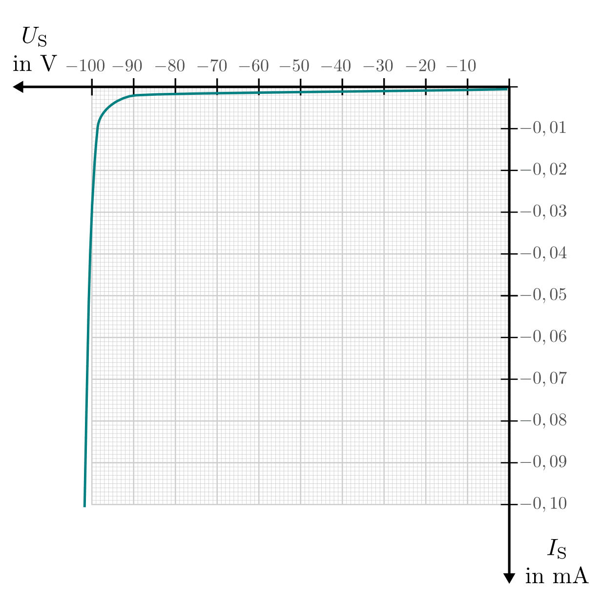

.. index:: Diode
.. _Diode:
.. _Dioden:

Dioden
======

Ähnlich wie eine :ref:`Röhrendiode <Röhrendiode>` stellt eine Halbleiter-Diode
eine "elektrische Einbahnstraße" dar; elektrischer Strom kann eine
Halbleiter-Diode in nur einer Richtung passieren. 

.. _Normale Diode:

"Normale" Dioden
----------------

Eine Diode verfügt über zwei Anschlüsse, die als Anode und Kathode bezeichnet
werden. Strom kann nur durch eine Diode fließen, wenn die Anode zum Plus- und
die Kathode zum Minus-Pol zeigt; in der Gegenrichtung sperrt sie. Auf dem
Bauteil ist die Kathoden-Seite durch ein schwarzen oder weißen Ring
gekennzeichnet. Ab einer anliegenden Spannungsdifferenz von etwa
:math:`U _{\rm{D}} = \unit[0,7]{V}` beginnt in Durchlassrichtung Strom zu
fließen. 

    Schaltzeichen einer Diode. Der linke Anschlussdraht wird Anode, der rechte
    Kathode genannt.

    .. only:: html
    
        :download:`SVG: Schaltzeichen Diode
        <../pics/bauteile/schaltzeichen-diode.svg>`

Beim Durchgang durch eine Diode sinkt die Spannung -- anders als bei Ohmschen
Widerständen, die zum Durchlassen einer größeren Stromstärke stets auch eine
größere anliegende elektrische Spannung benötigen -- relativ konstant um
:math:`\unit[0,7]{V}` -- weitgehend unabhängig von der Stärke des fließenden
Stroms. Das Ohmsche Gesetz :math:`U = R \cdot I` ist somit nicht auf Dioden 
anwendbar.

.. figure::
    ../pics/bauteile/kennlinie-diode-durchlassrichtung.png
    :name: fig-kennlinie-diode-durchlassrichtung
    :alt:  fig-kennlinie-diode-durchlassrichtung
    :align: center
    :width: 50%

    Kennlinie einer Diode in Durchlassrichtung.

    .. only:: html
    
        :download:`SVG: Kennlinie einer Diode in Durchlassrichtung.
        <../pics/bauteile/kennlinie-diode-durchlassrichtung.svg>`

Legt man eine entgegengesetzte Spannung :math:`U _{\rm{S}}` an, so verhält sich
eine Diode bis zu einem bestimmten Spannungswert wie ein Isolator -- die Diode
"sperrt". Wird der Spannungswert, der vom Bautyp und Material der Diode abhängt,
überschritten, so nimmt die (ebenfalls in Gegenrichtung) fließende Stromstärke
:math:`I _{\rm{S}}` rasant zu; die Diode kann dabei schnell überhitzt bzw.
zerstört werden.

    Kennlinie einer :math:`\unit[100]{V}`-Diode in Sperrichtung.

    .. only:: html
    
        :download:`SVG: Kennlinie einer 100-V-Diode in Sperrichtung.
        <../pics/bauteile/kennlinie-diode-sperrrichtung.svg>`

Auf jeder Diode sind daher zwei charakteristische Werte aufgedruckt:

* Die in Volt angegebene Spannung sagt aus, mit welcher Spannung die Diode
  maximal entgegen der Durchlassrichtung (in "Sperrichtung") betrieben werden
  darf.

* Die in (Milli-)Ampere angegebene Stromstärke gibt an, welcher Strom maximal
  durch die Diode fließen darf.

Beide Werte dürfen nicht überschritten werden, da die Diode ansonsten zerstört
werden kann.

*Beispiel:*

* Für die Diode ``1N4001`` sind die Werte :math:`\unit[50]{V}/\unit[1]{A}`
  angegeben -- die maximale Spannung in Sperrichtung darf somit höchstens
  :math:`\unit[50]{V}`, die maximale Stromstärke in Durchlassrichtung
  höchstens :math:`\unit[1]{A}` betragen.

.. index:: 
    single: Diode; Leuchtdiode (LED)
    single: Leuchtdiode (LED)
.. _Leuchtdiode:

Leuchtdioden
------------

Leuchtdioden ("Light Emitting Diods", kurz: LEDs) sind spezielle Dioden, die in
einem durchsichtigen Gehäuse eingebaut sind und aufleuchten, wenn Strom durch
sie fließt. Die übliche Betriebspannung einer Leuchtdiode liegt normalerweise
bei :math:`U = \unit[1,4]{V}`; maximal darf an LEDs (je nach Bautyp) eine
Spannung von :math:`\unit[1,6]{V} \le U _{\rm{max}} \le \unit[2,4]{V}` angelegt
werden. [#]_ Die Stromstärke :math:`I` beträgt dabei zwischen
:math:`\unit[15]{mA}` und :math:`\unit[25]{mA}`. 

    Schaltzeichen einer Leuchtdiode (LED).

    .. only:: html
    
        :download:`SVG: Schaltzeichen Leuchtdiode
        <../pics/bauteile/schaltzeichen-diode-leuchtdiode.svg>`

Die Anode der Leuchtdiode, die durch einen längeren Anschlussdraht
gekennzeichnet ist, muss mit dem Pluspol und die Kathode  mit dem Minuspol der
Stromquelle verbunden sein. Die Anoden- und Kathodenseite einer LED lässt sich,
wie in Abbildung :ref:`Bauform Leuchtdiode <fig-bauform-Leuchtdiode>`
dargestellt, ebenfalls anhand ihres Innenaufbaus erkennen.

.. figure::
    ../pics/bauteile/bauform-leuchtdiode.png
    :name: fig-bauform-leuchtdiode
    :alt:  fig-bauform-leuchtdiode
    :align: center
    :width: 40%

    Bauform einer Leuchtdiode (LED).

    .. only:: html
    
        :download:`SVG: Bauform einer Leuchtdiode
        <../pics/bauteile/bauform-leuchtdiode.svg>`

.. index:: 
    single: Diode; Photodiode
    single: Photodiode

.. _Photodiode:

Photodioden
-----------

Trifft Licht auf eine Photodiode, so wird in dieser ein elektrischer Strom
ausgelöst, der als Photostrom :math:`I _{\rm{P}}` bezeichnet wird. Je nach
Ausführung liegt die Lichtempfindlichkeit der Photodiode im Infrarot-,
Ultraviolett- oder im sichtbaren Bereich des Lichts.

    Schaltzeichen einer Fotodiode.

    .. only:: html
    
        :download:`SVG: Schaltzeichen Fotodiode
        <../pics/bauteile/schaltzeichen-diode-fotodiode.svg>`

..  .. _Solarzelle:

..  Solarzellen
..  -----------

.. Eine Solarzelle besteht im Prinzip ebenfalls aus einer grossflächigen
..  Halbleiterdiode. Eine dünne Silicium-Scheibe wird dazu von der Rückseite her
..  p-dotiert und mit einem elektrischen Kontakt versehen; die Vorderseite ist dünn
..  n-dotiert und ebenfalls mit einem elektrischen Kontakt versehen, indem man das
..  Silizium mit einem Gitter elektrischer Leiterbahnen überzieht. Durch die dünne
..  n-dotierte Schicht auf der Vorderseite hindurch einfallendes Licht löst
..  Einzelelektronen in der p-dotierten Seite aus ihren Bindungen und erzeugt so
..  Elektronen-Loch-Paare. Die Sperrschicht der Diode verhindert, dass sich diese
..  Elektronen-Loch-Paare sofort wieder ausgleichen. Wird eine Solarzelle
..  beleuchtet, dann liegt an ihren Polen eine Spannung von 0,6 Volt
..  (Leerlaufspannung) an; sie sinnkt, wenn ein Verbraucher angeschlossen wird.

.. todo:: 

    Zener-Dioden

    Halbleiterdiode mit ausgeprägt steilem Durchbruch in Rückwärtsrichtung
    aufgrund des Zener- oder Lawineneffektes. Diese Diode ist für Dauerbetrieb
    im Durchbruchbereich vorgesehen.

..  
    Ein ganz anderes "Verhalten" weisen die so genannten Zenerdioden auf: Sie
    funktionieren als eine Art Spannungsbarrieren (nach Abb. 3.22a) bzw. als
    "Spannungsschlucker" (nach Abb. 3.22b). Man macht sich diese Eigenheit der
    Zenerdioden u.a. dort zu Nutzen, wo man in einem kleinen Schaltungsteil eine
    stabile "Zweitspannung" benötigt.
    
    Wenn uns beispielsweise in einem Gerät nur eine 9-V-Versorgungsspannung zur
    Verfügung steht und wir benötigen zusätzlich eine 5,1-V-Zweitspannung, so kann
    dies nach Abb. 3.22a bewerkstelligt werden. Der Ohmsche Wert des Vorwiderstandes
    Rx muss so gewählt werden, dass auch bei der vorgesehenen Stromabnahme am
    5,1-Volt-Ausgang die Zenerdiode (ZPD 5,1 V) „gerade noch“ die benötigte
    5,1-V-Spannung erhält. Erhält sie weniger, dann kann sie die Spannung auf die
    benötigten 5,1 V von sich aus natürlich nicht erhöhen. Ist der Widerstand Rx
    wiederum zu niedrig, fließt durch die Zenerdiode ein zu hoher Strom, der sie
    entweder nur sehr aufheizt oder sogar vernichtet (hier ist – ähnlich, wie bei
    einem Widerstand – auf die Leistung der angewendeten Zenerdiode zu achten).
    
    Zenerdioden sind für Festspannungen von 1 V bis ca. 180 V erhältlich --
    allerdings in einer etwas gröberen Abstufung. Üblicherweise geht bei Zenerdioden
    bereits aus der Typenbezeichnung – die z.B. „ZPD 5,1 V“ lautet – hervor, für
    welche Zenerspannung sie ausgelegt sind. Sie sind zudem – ähnlich wie
    Widerstände – für verschiedene Leistungen erhältlich.
    
    Die Zenerdiode (ZPD 3 V) in Abb. 3.22b fungiert zwar elektrisch auf dieselbe
    Weise, wie die Zenerdiode in Abb. 3.22a, ist jedoch in der Schaltung ein wenig
    anders angeordnet. Sie verhält sich hier als ein „Spannungsschlucker“ und
    schluckt einfach (ohne Rücksicht auf den Strom, der sie durchfließt) ihre
    „Zenerspannung“. Sie frisst sozusagen diese Spannung in sich hinein und lässt
    nur den Rest der ihr zugeführten Spannung weiter durchfließen. Das trifft sich
    gut, wenn man z.B. in dem Schaltbeispiel nach Abb. 3.22b das IC1 mit einer
    6-V-Spannung und das IC2 mit der vorhandenen 9-V-Spannung versorgen möchte (oder
    muss).
    
    Wenn wir beispielsweise in dieser Schaltung anstelle der 9-V-Spannung eine
    23-V-Spannung über eine 10-V-Zenerdiode zum IC1 führen würden, bekäme dieses IC
    eine „Restspannung“ von 13 V. Die 10-V-Zenerspannung würde die Zenerdiode (z.B.
    die Type ZPD 10 V) für sich behalten.
    
    Wozu so etwas in der Praxis überhaupt gut sein kann, darauf kommen wir noch im
    Zusammenhang mit „Sound-ICs“ später zurück.

.. raw:: html

    

.. only:: html

    .. rubric:: Anmerkung:

.. [#]  Die zulässigen Spannungen von Leuchtdioden sind je nach
    Helligkeit und Farbe unterschiedlich; hierbei sind die Herstellerangaben zu
    beachten. Typischerweise liegt die Betriebsspannung bei roten LEDs bei
    :math:`\unit[1,9]{V}`, bei gelben LEDs bei :math:`\unit[2,0]{V}`, bei
    grünen LEDs bei :math:`\unit[2,4]{V}`. Blaue und weiße LEDs werden
    teilweise sogar mit :math:`3 \text{ bis } \unit[3,5]{V}` betrieben. Die
    Stromstärke liegt jeweils bei :math:`\unit[20]{mA}`.

..      
    Die Diode gehört zur Gruppe der Halbleiter. Sie ist ein Bauelement mit einem
    pn-Übergang. Der Anschluss am p-Bereich heisst Anode, der am n-Bereich
    Kathode. Je nach Richtung der angelegten Spannung lässt die Diode den Strom
    passieren oder sie sperrt ihn. Eine Diode muss daher richtig gepolt in die
    Schaltung eingebaut werden. In der Regel ist die Kathode durch einen Ring am
    Gehäuse gekennzeichnet. Bei mehreren Ringen auf dem Gehäuse kennzeichnet der
    erste breite Ring die Kathode.
    
    Halbleiter sind Stoffe, deren spezifischer Widerstand (bzw. Leitfähigkeit)
    zwischen dem von Leitern (z.B. Metall) und dem von Isolatoren (z.B. Glas,
    Keramik) liegt, da sie im Gegensatz zu Leitern kaum freie Elektronen
    besitzen. Die gebräuchlichsten Grundstoffe für Halbleiterbauelemente sind
    Silizium (z.B. aus Quarzsand) oder Germanium. Für den Aufbau von
    Halbleiterbauelementen benötigt man Halbleitermaterial, dessen Leitfähigkeit
    weitgehend temperaturunabhängig und sehr viel höher ist als bei der
    Eigenleitung. Deshalb fügt man in das Siliziumkristallgitter Fremdatome ein.
    
