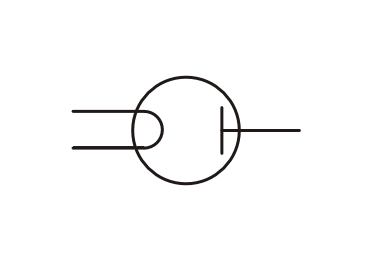
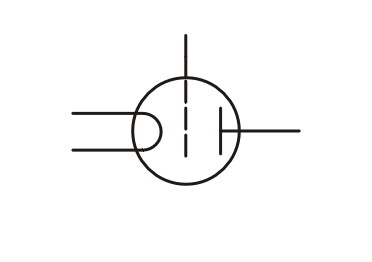

.. _Elektronenröhre:

Elektronenröhren
----------------

Die Erfindung der Elektronenröhre
^^^^^^^^^^^^^^^^^^^^^^^^^^^^^^^^^

Die Erfindung der Elektronenröhre im Jahr 1883 ging ebenfalls auf `Thomas Alva
Edison <http://de.wikipedia.org/wiki/Thomas_Alva_Edison>`_ zurück. Er brachte in
den Glaskolben einer seiner Glühlampen eine kleine Metallplatte ein, in der
Hoffnung, dass sich dadurch die Lampeninnenseite durch die aus dem
stromdurchflossenen Kohlefaden austretende Rußpartikel nicht schwärzen würde.
Diese "Staubteilchen" sollten sich, so die Hoffnung Edisons -- vielmehr an der
Metallplatte anlagern. Dazu verband Edison die Metallplatte von außen mit dem
Stromkreis, der den glühenden Faden heizte. Aus Interesse schloss Edison
zusätzlich ein Amperemeter an den Draht an.

.. pic

Tatsächlich zeigte das Amperemeter einen schwachen Strom an, obwohl nur *ein*
Draht mit der Metallplatte verbunden war; der Stromkreis war daher nicht
geschlossen. In weiteren Experimenten fand Edison heraus, dass nur dann ein
Strom durch das Amperemeter floss, wenn die Metallplatte mit dem positiven Pol
der Stromquelle verbunden war -- lag eine negative Spannung an der Platte an, so
floss kein Strom. Edison bezeichnete die positiv geladene Metallplatte später
als Anode.

Ohne es zu ahnen, hatte Edison damit die erste Röhrendiode entwickelt.

.. _Röhrendiode:

Elektronenröhren-Dioden
^^^^^^^^^^^^^^^^^^^^^^^

Eine Röhrendiode (*di* = griech. zwei) besteht aus einem vakuumierten
Glaskolben, in den zwei metallische Elektroden -- eine Kathode und eine Anode --
eingebaut sind.

    Schaltzeichen einer Röhrendiode.

    .. only:: html

        :download:`SVG: Schaltzeichen Röhrendiode
        <../pics/bauteile/schaltzeichen-roehrendiode.svg>`

Die Kathode :math:`\mathrm{K}` besteht aus einem sehr dünnen Draht, der sich bei
anliegender Spannung aufgrund seines elektrischen Widerstands in kurzer Zeit bis
zur Weißglut erhitzt. Aufgrund der hohen thermischen Energie verlassen dabei
auch Elektronen den Draht und umgeben ihn in Form einer winzigen "Ladungswolke".
Beim Herauslösen der Elektronen bleiben in der Kathode positiv geladene
Atomrümpfe zurück. Diese üben eine elektrische Anziehungskraft auf die
ausgetretenen Elektronen aus, so dass sich ein Gleichgewicht zwischen der
thermischen Bewegung und der elektrischen Anziehung einstellt.

.. pic Elektronenroehre PK89

Die Anode :math:`\mathrm{A}` besteht, wie in Edisons Versuch, aus einer kleinen Metallplatte.
Wird an dieser eine genügend große positive Spannung angelegt, so lassen sich
Elektronen von der Kathode zur Anode hin "absaugen". Damit ergibt sich folgender
Stromkreis: Ausgehend vom Minuspol der Stromquelle treten die Elektronen an der
glühenden Kathode aus, strömen durch das Vakuum und fließen über die Anode zum
Pluspol Stromquelle zurück.

Bei einer Umpolung der angeschlossenen Spannung tritt in der Elektronenröhre
kein Stromfluss auf. Aufgrund dieser Eigenschaft, elektrischen Strom nur in eine
Richtung fließen zu lassen, wurden Röhrendioden eine Zeit lang als Gleichrichter
eingesetzt. Inzwischen wurden sie weitestgehend durch :ref:`Halbleiter-Dioden
<Diode>` ersetzt, da diese bei gleicher Funktionalität kleiner und
kostengünstiger hergestellt werden können und zugleich weniger elektrische
Energie benötigen.

.. Verbesserung durch John Fleming ... Anoden-Zylinder umgibt Kathode. Z: WW13

.. _Röhrentriode:

Elektronenröhren-Trioden
^^^^^^^^^^^^^^^^^^^^^^^^

Eine Röhrentriode (*tri* = griech. drei) ist prinzipiell wie eine Röhrendiode
aufgebaut, mit dem Unterschied, dass sich zwischen Kathode und Anode ein
metallischer Draht in Zickzack-Form ("Gitter") als dritte Elektrode befindet.

    Schaltzeichen einer Röhrentriode.

    .. only:: html

        :download:`SVG: Schaltzeichen Röhrentriode
        <../pics/bauteile/schaltzeichen-roehrentriode.svg>`

.. lee de forest.

Über die am Gitter :math:`\mathrm{G}` anliegende Spannung ist es auf einfache
Weise möglich, die Stärke des durch die Elektronenröhre fließenden Stromes zu
bestimmen:

* Liegt keine Spannung am Gitter an, so können die Elektronen es (nahezu)
  ungehindert durchdringen. Der Strom in der Elektronenröhre entspricht in
  diesem Fall dem einer Röhrendiode (ohne Gitter).
* Liegt eine negative Spannung am Gitter an, so wirkt es auf die von der Kathode
  kommenden Elektronen abstoßend -- es gelangen somit nur weniger Elektronen zur
  Anode. Der Strom in der Elektronenröhre wird abgeschwächt.

Bereits mit einer schwachen Gitterspannung kann somit schnell und präzise der
eigentliche Elektronenstrom in der Röhrentriode geregelt werden. Diese
elektronische Steuerung ist sogar so schnell, dass auch rasch wechselnde
Spannungen wie Antennensignale (einige MHz!) auf den eigentlichen
Elektronenstrom in der Röhre "abgebildet" und aus diesem wieder "herausgelesen"
werden können. [#]_

Die Signal verstärkende Wirkung von Röhrentrioden bildete die Grundlage für die
Rundfunk- und Fernseh-Technik des 20. Jahrhunderts. Inzwischen wurden sie
insbesondere aufgrund des vergleichsweise hohen Platzbedarfs und der hohen
Herstellungskosten bis auf wenige Spezialfälle durch Transistoren ersetzt.

.. raw:: html

    

.. only:: html

    .. rubric:: Anmerkungen:

.. [#]  Die Projektion des Steuersignals auf den durch die Röhre fließenden
        Strom erzeugt ein "Negativ" des eigentlichen Signals: Ist das
        Antennensignal stark, so wird der Stromfluss in der Triode minimal und
        umgekehrt. Um ein verstärktes Signal zu erhalten, das mit dem
        Ausgangssignal identisch ist, wird der Prozess zweimal durchlaufen, d.h.
        die auf die Anode der ersten Röhrentriode gelangenden Elektronen werden
        zum Gitter der zweiten Triode weitergeleitet und dienen dort als
        Reglersignal.

..
    Braunsche Roehre PK104; Elektronenstrahl, der auf Leuchtschicht eines
    Leuchtschirms trifft.
