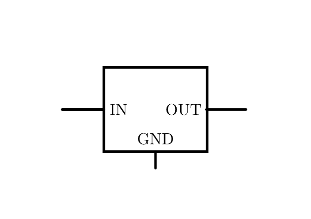
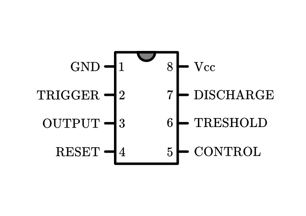

.. _Integrierte Schaltkreise:

Integrierte Schaltkreise
========================

Ein integrierter Schaltkreis ("Integrated Circuit" oder kurz "IC") ist ein
Bauteil, das seinerseits eine Schaltung mitsamt allen notwendigen Bauelementen
auf sehr kleinem Raum beinhaltet. Es gibt tausende verschiedener IC-Typen für
die verschiedensten Einsatzbereiche. Auch Mikroprozessoren, wie sie in Computern
verwendet werden, zählen zu den integrierten Schaltkreisen.

.. _Spannungsregler:

Spannungsregler
---------------

Spannungsregler liefern, wie ihr Name andeutet, stets eine bestimmte
Gleichspannung; der Wert der Spannung kann bei unterschiedlichen Typen
einstellbar oder vom Bauteil festgelegt sein. 

    Schaltzeichen eines Spannungsreglers.

    .. only:: html
    
        :download:`SVG: Schaltzeichen Spannungsregler
        <../pics/bauteile/schaltzeichen-spannungsregler.svg>`

Die Gehäuseform eines Spannungsreglers ähnelt der eines TO-220-Transistors. Am
linken Anschluss wird der Spannungsregler mit der ``+``-Seite der Stromquelle
:math:`(\rm{IN})` verbunden, am mittleren liegt die Masse :math:`(\rm{GND})` an.
Am rechten Anschluss kann die vom Spannungsregler bereitgestellte konstante
Ausgangsspannung :math:`(\rm{OUT})` abgegriffen werden. 

..  [#]_

.. _NE555-Timer:

Der NE555-Timer
---------------

Der NE555-Timer ist seit seiner Erstentwicklung im Jahr 1970 einer der
beliebtesten Integrierten Schaltkreise überhaupt. Er kann als einzelnes Bauteil
beispielsweise als astabile oder monostabile Kippstufe verwendet werden. 

Der NE555 kann mit einer Spannungsquelle zwischen :math:`\unit[4,5]{V}` und
:math:`\unit[15]{V}` betrieben werden; als Output liefert er ein digitales
Signal, das entweder mit :math:`\unit[0]{V}` "aus" oder mit einer Spannung von
mindestens :math:`\unit[2,5]{V}` "an" ist.

    Schaltzeichen des NE555-Timers.

    .. only:: html
    
        :download:`SVG: Schaltzeichen NE555
        <../pics/bauteile/schaltzeichen-ne555.svg>`

Der Aufbau eines NE555 sieht als DIP-8-Baustein folgendermaßen aus:

* Pin 1 ("Ground") wird mit der Masse (GND) verbunden
* Pin 8 ("Vcc") wird mit der Eingangsspannung :math:`(\unit[4,5 \text{ bis }
  15]{V})` verbunden.
* Pin 3 ("Output") ist der Ausgangs-Pin. Die abgegebene Spannung ist entweder
  :math:`\unit[0]{V}`, wenn der Pin auf "aus" steht, oder nahe dem Wert der
  Eingangsspannung, wenn der Pin auf "an" steht. Ob und wie lange der Pin auf
  "an" bzw. "aus" steht, hängt von den Anschlüssen an den anderen fünf Pins
  ab.
* Pin 2 ("Trigger") kann den Ausgangs-Pin an- oder ausschalten. Liegt am
  Trigger-Pin eine geringere Spannung als ein Drittel der Eingangsspannung an,
  so wird der Ausgangs-Pin aktiviert. Beispielsweise kann man so den Trigger-Pin
  einerseits mit der Eingangsspannung, andererseits über einen Taster mit der
  Masse (GND) verbinden. Drückt man den Taster, so wird der Pin
  kurzgeschlossen, und damit der Ausgangs-Pin aktiviert.
* Pin 7 ("Discharge") wird meist über einen Widerstand mit der Eingangsspannung
  und über einen Kondensator mit der Masse verbunden.
* Pin 6 ("Treshold") wird üblicherweise so angeschlossen, dass damit die
  Spannung am Kondensator zwischen Pin 7 und Masse gemessen wird. Liegt diese
  Spannung über zwei Drittel der Eingangsspannung, wird der Ausgangs-Pin
  deaktiviert.
* Pin 5 ("Control") wird üblicherweise über einen Kondensator mit geringer
  Kapazität (ca. :math:`\unit[0,01]{\mu F}`) mit der Masse verbunden. Die
  Aufgabe dieses Pins liegt darin, mögliche Schwankungen der Eingangsspannung
  auszugleichen, damit diese die Funktionsweise des Timers nicht
  beeinträchtigen können. [#]_
* Pin 4 ("Reset") kann genutzt werden, um den Timer neu zu starten. Ebenso wie
  der Trigger-Pin wird dieser Pin mit der Eingangsspannung verbunden. Wird der
  Pin beispielsweise mittels eines mit der Masse (GND) verbundenen Tasters
  kurzgeschlossen, so unterbricht der Timer seine Arbeit, und beginnt erst von
  vorne, wenn am Reset-Pin (und am Pin 2) wieder eine Spannung anliegt.

..  Logik-Gatter
..  ------------

..  Logische Gatter sind Schaltkreise, welche logische Operatoren wie UND, ODER,
..  NICHT usw. auf elektronischem Weg realisieren. Sie verarbeiten Spannungen an den
..  Leistungseingängen als Eingangssignale und liefern als Ausgangssignal -- je
..  nachdem, ob die entsprechende logische Verknüpfung wahr oder falsch ergibt --
..  eine bzw. keine Spannung am Leistungsausgang.

..  .. only:: html

    ..  .. rubric:: Anmerkungen:

..  .. [#]  Dies gilt für die am häufigsten auftretende Form von Spannungsreglern,
        ..  die eine positive Ausgangsspannung besitzen. Spannungsregler mit einer
        ..  negativen Ausgangsspannung haben vertauschte Anschlüsse.

.. raw:: html

    

.. only:: html

    .. rubric:: Anmerkungen:

.. [#] In seltenen Fällen wird der Control-Pin auch über einen Widerstand mit
    der Eingangsspannung verbunden, so dass eine geringe Spannung an diesem Pin
    anliegt. Diese Spannung ändert die Treshold-Spannung von Pin 6 und kann
    somit die Frequenz des Timers beeinflussen.

