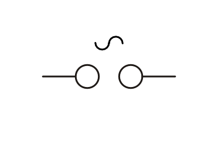

.. index:: Stromquelle
.. _Stromquellen:

Stromquellen
===============

Damit ein elektrischer Strom fließen kann, muss eine elektrische Spannung
existieren. Diese wird von einer Stromquelle bereitgestellt.

.. _Stromquellen mit Gleichspannung:

Stromquellen mit Gleichspannung
-------------------------------

Da viele elektronische Bauteile ausschließlich mit Gleichspannung
funktionieren, haben Gleichstromquellen eine besondere Bedeutung.

    Schaltzeichen einer Stromquelle mit Gleichspannung.

    .. only:: html

        :download:`SVG: Schaltzeichen Stromquelle (Gleichspannung)
        <../pics/bauteile/schaltzeichen-stromquelle-gleichspannung.svg>`

Am Minuspol einer Stromquelle besteht ein Elektronenüberschuss, am Pluspol ein
Elektronenmangel. Beide Zustände werden durch Vorgänge im Inneren der
Stromquelle erzeugt bzw. aufrecht erhalten.

.. _Batterien:

.. rubric:: Batterien

Batterien haben chemische Energie im Inneren gespeichert und sind in der Lage,
diese in Form von elektrischer Energie freizusetzen. Entladene Batterien, deren
gespeicherte Energiemenge verbraucht ist, müssen an einer Wertstoff-Sammelstelle
abgegeben oder in speziell dafür aufgestellte Sammelboxen geworfen werden. [#]_
Auf diese Weise können die Bestandteile der Batterie (weitgehend) recyclet
werden, und es gelangen zumindest weitaus weniger Giftstoffe in die Umwelt.

Batterien können nicht wieder aufgeladen werden und weisen somit gegenüber
Akkumulatoren sowohl aus wirtschaftlicher wie aus ökologischer Sicht erhebliche
Nachteile auf. Sie werden normalerweise nur dann in mobilen Bereichen
eingesetzt, wenn eine vergleichsweise höhere Speicherkapazität und/oder eine
geringfügig höhere Leistungsabgabe zwingend erforderlich sind.

.. rubric:: Akkumulatoren

Akkumulatoren (auch "Akkus genannt) sind "wiederaufladbare Batterien". Beim
Aufladen wird elektrische Energie in Form von chemischer Energie durch die
Umwandlung von Stoffen im Inneren des Akkus gespeichert. Beim Entladen läuft der
chemische Prozess in umgekehrter Richtung ab, und es wird elektrische Energie
freigegeben.

*Beispiel:*

..  - Nickel-Cadmium-Akkumulator

* Blei-Akkumulator:

    Im ungeladenen Zustand bestehen die Platten aus Bleisulfat
    :math:`(\ce{PbSO4})`. Beim Aufladen reagiert die positive Elektrode zu
    Bleioxid :math:`(\ce{PbO2})` und die negative Elektrode zu Blei
    :math:`(\ce{Pb})`. Als Elektrolyt wird verdünnte Schwefelsäure verwendet.

    Die Spannung je Zelle beträgt etwa :math:`\unit[2]{V}`. In handelsüblichen
    Blei-Akkumulatoren sind meistens sechs Zellen in einer Reihenschaltung
    miteinander verbunden, so dass an den Anschlüsssen eine Spannung von
    :math:`\unit[12]{V}` abgegriffen werden kann.

.. _Netzteile:

.. rubric:: Netzteile

Für stationäre Anwendungen haben (kabelgebundene) Netzteile mehrere Vorteile
gegenüber Batterien oder Akkumulatoren: Sie müssen nicht ausgetauscht werden,
und liefern stets zuverlässig (ohne Entladungs-Erscheinungen) die gewünschte
Spannung.

Gleichspannungs-Netzteile ("DC" bzw. "Direct Current") bestehen normalerweise
aus einem Transformator, einem (Brücken-)Gleichrichter, einem Spannungsregler
und einigen Kondensatoren. Je nach Typ des eingebauten Spannungsreglers liefern
Netzteile eine feste oder einstellbare Ausgangs-Spannung.

.. rubric:: Solarzellen

Solarzellen werden, häufig in Kombination mit Akkumulatoren, sowohl in
stationären wie in mobilen Anwendungsbereichen mit geringem Stromverbrauch
eingesetzt. Je nach Modulgröße liefern sie unterschiedlich hohe Spannungen
bzw. Stromstärken.

.. _Stromquellen mit Wechselspannung:

Stromquellen mit Wechselspannung
--------------------------------

Haushalts-Steckdosen stellen eine Wechselspannung von :math:`\unit[230]{V}`
bereit, wobei die zulässige Stromstärke durch Sicherungen meist auf
:math:`\unit[16]{Ampere}` begrenzt ist -- es kann somit eine maximale
elektrische Leistung von :math:`\unit[230]{V} \cdot \unit[16]{A} =
\unit[3680]{W}` abgegriffen werden. Die Spannung wird in Kraftwerken mittels
Generatoren (oder mittels Solarzellen und Wechselrichtern) erzeugt und -- nach
eine Spannungsanpassung -- über (Hoch-)Spannungsleitungen an die jeweiligen Orte
übertragen.

    Schaltzeichen einer Stromquelle mit Wechselspannung.

    .. only:: html

        :download:`SVG: Schaltzeichen Stromquelle (Wechselspannung)
        <../pics/bauteile/schaltzeichen-stromquelle-wechselspannung.svg>`

..  bzw. ein direkter Anschluss elektrischer Bauteile an den

Während elektrische Experimente mit "Netzspannung" aufgrund der hohen
elektrischen Leistung lebensgefährlich (!!) sind, kann die Wechselspannung des
Stromnetzes :math:`(230 V)` mittels eines Transformators einfach auf eine
geringere Spannung eingestellt werden. Je nach Bauweise können sich
Transformatoren entweder direkt in den Geräten befinden (z.B. in Fernsehgeräten,
Radios usw.), oder in Form von separaten Netzteilen vorliegen (z.B. bei
Notebooks).

Auch für Elektronik-Versuche mit Wechselspannung sollte stets ein geeignetes
Wechselspannungs-Netzteil ("AC" bzw. "Alternating Current") verwendet werden.

.. raw:: html

    

.. only:: html

    .. rubric:: Anmerkungen:

.. [#]  In Deutschland ist jeder Batterien-Händler gesetzlich dazu verpflichtet,
        entladene Batterien wieder zurück zu nehmen und diese an einer
        Wertstoff-Sammelstelle abzugeben.

