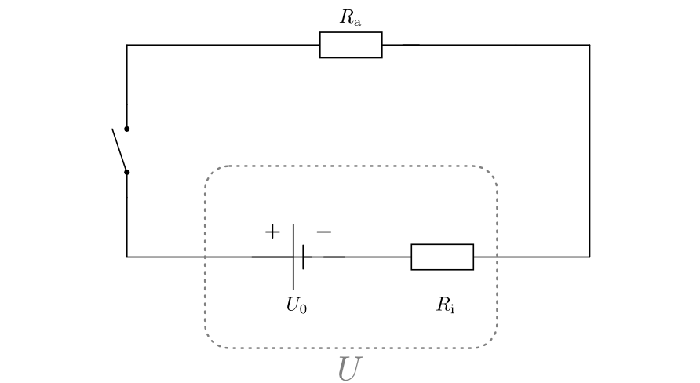
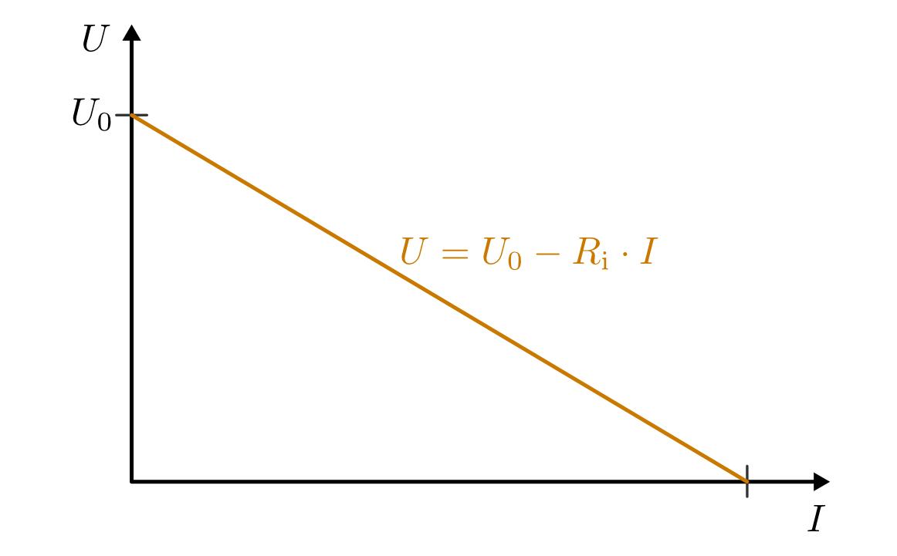

.. index:: Stromquelle
.. _Stromquellen:

Stromquellen
===============

Damit ein elektrischer Strom fließen kann, muss eine elektrische Spannung
existieren. Diese wird von einer Stromquelle bereitgestellt.

.. _Stromquellen mit Gleichspannung:

Stromquellen mit Gleichspannung
-------------------------------

Da viele elektronische Bauteile ausschließlich mit Gleichspannung
funktionieren, haben Gleichstromquellen eine besondere Bedeutung.

.. figure::
    ../pics/bauteile/schaltzeichen-stromquelle-gleichspannung.png
    :name: fig-schaltzeichen-stromquelle-gleichspannung
    :alt:  fig-schaltzeichen-stromquelle-gleichspannung
    :align: center
    :width: 30%

    Schaltzeichen einer Stromquelle mit Gleichspannung.

    .. only:: html

        :download:`SVG: Schaltzeichen Stromquelle (Gleichspannung)
        <../pics/bauteile/schaltzeichen-stromquelle-gleichspannung.svg>`

Am Minuspol einer Stromquelle besteht ein Elektronenüberschuss, am Pluspol ein
Elektronenmangel. Beide Zustände werden durch Vorgänge im Inneren der
Stromquelle erzeugt beziehungsweise aufrecht erhalten.

.. _Batterien:

.. rubric:: Batterien

Batterien haben chemische Energie im Inneren gespeichert und sind in der Lage,
diese in Form von elektrischer Energie freizusetzen. Entladene Batterien, deren
gespeicherte Energiemenge verbraucht ist, müssen an einer Wertstoff-Sammelstelle
abgegeben oder in speziell dafür aufgestellte Sammelboxen geworfen werden. [#]_
Auf diese Weise können die Bestandteile der Batterie (weitgehend) recyclet
werden, und es gelangen zumindest weitaus weniger Giftstoffe in die Umwelt.

Batterien können nicht wieder aufgeladen werden und weisen somit gegenüber
Akkumulatoren sowohl aus wirtschaftlicher wie aus ökologischer Sicht erhebliche
Nachteile auf. Sie werden normalerweise nur dann in mobilen Bereichen
eingesetzt, wenn eine vergleichsweise höhere Speicherkapazität und/oder eine
geringfügig höhere Leistungsabgabe zwingend erforderlich sind.

.. rubric:: Akkumulatoren

Akkumulatoren (auch "Akkus genannt) sind "wiederaufladbare Batterien". Beim
Aufladen wird elektrische Energie in Form von chemischer Energie durch die
Umwandlung von Stoffen im Inneren des Akkus gespeichert. Beim Entladen läuft der
chemische Prozess in umgekehrter Richtung ab, und es wird elektrische Energie
freigegeben.

*Beispiel:*

..  - Nickel-Cadmium-Akkumulator

* Blei-Akkumulator:

    Im ungeladenen Zustand bestehen die Platten aus Bleisulfat
    :math:`(\ce{PbSO4})`. Beim Aufladen reagiert die positive Elektrode zu
    Bleioxid :math:`(\ce{PbO2})` und die negative Elektrode zu Blei
    :math:`(\ce{Pb})`. Als Elektrolyt wird verdünnte Schwefelsäure verwendet.

    Die Spannung je Zelle beträgt etwa :math:`\unit[2]{V}`. In handelsüblichen
    Blei-Akkumulatoren sind meistens sechs Zellen in einer Reihenschaltung
    miteinander verbunden, so dass an den Anschlüsssen eine Spannung von
    :math:`\unit[12]{V}` abgegriffen werden kann.

.. _Netzteile:

.. rubric:: Netzteile

Für stationäre Anwendungen haben (kabelgebundene) Netzteile mehrere Vorteile
gegenüber Batterien oder Akkumulatoren: Sie müssen nicht ausgetauscht werden,
und liefern stets zuverlässig (ohne Entladungs-Erscheinungen) die gewünschte
Spannung.

Gleichspannungs-Netzteile ("DC" bzw. "Direct Current") bestehen normalerweise
aus einem Transformator, einem (Brücken-)Gleichrichter, einem Spannungsregler
und einigen Kondensatoren. Je nach Typ des eingebauten Spannungsreglers liefern
Netzteile eine feste oder einstellbare Ausgangs-Spannung.

.. rubric:: Solarzellen

Solarzellen werden, häufig in Kombination mit Akkumulatoren, sowohl in
stationären wie in mobilen Anwendungsbereichen mit geringem Stromverbrauch
eingesetzt. Je nach Modulgröße liefern sie unterschiedlich hohe Spannungen
bzw. Stromstärken.

.. _Stromquellen mit Wechselspannung:

Stromquellen mit Wechselspannung
--------------------------------

Haushalts-Steckdosen stellen eine Wechselspannung von :math:`\unit[230]{V}`
bereit, wobei die zulässige Stromstärke durch Sicherungen meist auf
:math:`\unit[16]{Ampere}` begrenzt ist -- es kann somit eine maximale
elektrische Leistung von :math:`\unit[230]{V} \cdot \unit[16]{A} =
\unit[3680]{W}` abgegriffen werden. Die Spannung wird in Kraftwerken mittels
Generatoren (oder mittels Solarzellen und Wechselrichtern) erzeugt und -- nach
eine Spannungsanpassung -- über (Hoch-)Spannungsleitungen an die jeweiligen Orte
übertragen.

.. figure::
    ../pics/bauteile/schaltzeichen-stromquelle-wechselspannung.png
    :name: fig-schaltzeichen-stromquelle-wechselspannung
    :alt:  fig-schaltzeichen-stromquelle-wechselspannung
    :align: center
    :width: 30%

    Schaltzeichen einer Stromquelle mit Wechselspannung.

    .. only:: html

        :download:`SVG: Schaltzeichen Stromquelle (Wechselspannung)
        <../pics/bauteile/schaltzeichen-stromquelle-wechselspannung.svg>`

..  bzw. ein direkter Anschluss elektrischer Bauteile an den

Während elektrische Experimente mit "Netzspannung" aufgrund der hohen
elektrischen Leistung lebensgefährlich (!!) sind, kann die Wechselspannung des
Stromnetzes :math:`(230 V)` mittels eines Transformators einfach auf eine
geringere Spannung eingestellt werden. Je nach Bauweise können sich
Transformatoren entweder direkt in den Geräten befinden (z.B. in Fernsehgeräten,
Radios usw.), oder in Form von separaten Netzteilen vorliegen (z.B. bei
Notebooks).

Auch für Elektronik-Versuche mit Wechselspannung sollte stets ein geeignetes
Wechselspannungs-Netzteil ("AC" bzw. "Alternating Current") verwendet werden.

.. index:: Innenwiderstand, Außenwiderstand, Lastwiderstand

.. _Exkurs Innenwiderstand realer Stromquellen:

Exkurs: Innenwiderstand realer Stromquellen
-------------------------------------------

Wird ein Stromkreis geschlossen, so muss der Strom -- unabhängig von der Art der
Stromquelle -- stets auch durch diese selbst hindurch fließen. Stromquellen
haben hierbei einen eigenen elektrischen Widerstand, den man "Innenwiderstand"
:math:`R_{\mathrm{i}}` nennt -- in Unterscheidung zu den angeschlossenen
Verbrauchern, die man unter dem Begriff "Außenwiderstand" :math:`R_{\mathrm{a}}`
(beziehungsweise  "Lastwiderstand :math:`R_{\mathrm{L}}`) zusammenfasst.

    Ersatzschaltbild einer realen Stromquelle mit der Leerlaufspannung
    :math:`U_0` und dem Innenwiderstand :math:`R_{\mathrm{i}}`.

    .. only:: html

        :download:`SVG: Reale Stromquelle (Ersatzschaltbild)
        <../pics/bauteile/reale-stromquelle.svg>`

Der Gesamtwiderstand :math:`R_{\mathrm{ges}}` eines Stromkreises ist gleich der
Summe aus dem Innenwiderstand der Stromquelle und dem Außenwiderstand:

.. math::

    R_{\mathrm{ges}} = R_{\mathrm{i}} + R_{\mathrm{a}}

Wie bei einer :ref:`Reihenschaltung von Widerständen <Reihenschaltung von
Widerständen>` üblich, fällt ein Teil der Gesamtspannung am Innenwiderstand und
der restliche Teil am Außenwiderstand ab. Welcher Anteil der Gesamtspannung am
Außenwiderstand abfällt, hängt vom Anteil
:math:`\frac{R_{\mathrm{a}}}{R_{\mathrm{ges}}}` des Außenwiderstands am
Gesamtwiderstand ab. Üblicherweise ist der Außenwiderstand wesentlich größer als
der Innenwiderstand, und somit der Anteil des Außenwiderstands am
Gesamtwiderstand nahezu :math:`100\%`; folglich fallen auch fast :math:`100\%`
der Gesamtspannung am Außenwiderstand ab.

.. index:: Klemmenspannung
.. _Klemmenspannung und Leerlaufspannung:

.. rubric:: Klemmenspannung und Leerlaufspannung

Als "Klemmenspannung" :math:`U` einer Stromquelle bezeichnet man diejenige
Spannung, die zwischen den beiden Klemmen (Anschlüssen, Polen) der Stromquelle
anliegt; diese Spannung ist mit der Spannung identisch, die über dem
Außenwiderstand des Stromkreises abfällt.

.. index:: Leerlaufspannung

Die Klemmenspannung nimmt ihren maximalen Wert an, wenn der Außenwiderstand
unendlich groß ist: In diesem Fall fällt nahezu die gesamte Spannung am
Außenwiderstand und fast keine Spannung am Innenwiderstand ab. Da bei einem
unendlich großen Außenwiderstand allerdings auch kein Strom fließen kann, wird
dieser maximale Spannungswert auch "Leerlaufspannung" :math:`U_0` genannt.

Die Leerlaufspannung entspricht also dem Spannungswert einer Stromquelle, wenn
kein Verbraucher angeschlossen ist. Näherungsweise kann dieser Wert mit einem
Voltmeter gemessen werden, da dieses zwar keinen unendlichen, aber doch zu einen
sehr großen Widerstandswert hat.

    Diagramm der Klemmenspannung einer Stromquelle in Abhängigkeit des
    Innenwiderstands :math:`R_{\mathrm{i}}` und der fließenden Stromstärke
    :math:`I`.

    .. only:: html

        :download:`SVG: Klemmenspannung einer Stromquelle
        <../pics/bauteile/diagramm-klemmenspannung.svg>`

Wird ein Verbraucher mit einem endlichen Widerstand an die Stromquelle
angeschlossen, so stellt sich eine Stromstärke :math:`I =
\frac{U_0}{R_{\mathrm{ges}}}` ein, die sowohl durch den Verbraucher wie auch
durch die Stromquelle fließt. Am Innenwiderstand :math:`R_{\mathrm{i}}` der
Stromquelle fällt dabei nach dem :ref:`Ohmschen Gesetz <Ohmsches Gesetz>` die
Spannung :math:`U_{\mathrm{i}} = R_{\mathrm{i}} \cdot I` ab; die Klemmspannung
ist somit um diesen Betrag gegenüber der Leerlaufspannung verringert.
Für die Klemmspannung :math:`U` gilt in diesem Fall also:

.. math::
    :label: eqn-klemmenspannung

    U = U_0 - R_{\mathrm{i}} \cdot I

Je niedriger der Außenwiderstand eines Stromkreises ist, desto höher ist die
Stromstärke :math:`I`; dies hat eine Verringerung der Klemmspannung :math:`U`
zur Folge.

*Beispiel:*

* Wie groß ist die Klemmenspannung :math:`U` einer Stromquelle im Vergleich zu
  ihrer Leerlaufspannung :math:`U_0`, wenn der Außenwiderstand
  :math:`R_{\mathrm{a}}` gleich dem Innenwiderstand :math:`R_{\mathrm{i}}` der
  Stromquelle ist?

  Ist :math:`R_{\mathrm{i}} = R_{\mathrm{a}}`, so folgt für die die Stromstärke
  :math:`I`:

  .. math::

      I = \frac{U_0}{R_{\mathrm{ges}}} = \frac{U_0}{R_{\mathrm{i}} +
      R_{\mathrm{a}}} = \frac{U_0}{2 \cdot R_{\mathrm{i}}}

  Setzt man diesen Wert in die obige Formel :eq:`eqn-klemmenspannung` ein, so
  ergibt sich für die Klemmenspannung :math:`U`:

  .. math::

      U = U_0 - R_{\mathrm{i}} \cdot \frac{U_0}{2 \cdot R_{\mathrm{i}}} = U_0 -
      \frac{U_0}{2} = \frac{1}{2} \cdot U_0

  Die Klemmenspannung ist in diesem Fall auf die Hälfte der Leerlaufspannung
  abgesunken.

Bei einem Kurzschluss sinkt der Außenwiderstand auf nahezu Null ab; die
Stromstärke :math:`I` wird dann nur durch den meist sehr niedrigen
Innenwiderstand der Stromquelle begrenzt. Die hierbei auftretenden Stromstärken
können so groß sein, dass die Stromquelle durch die Wärmewirkung des Stroms
zerstört werden können; bei einem Kurzschluss besteht also Brandgefahr.

Batterien und Akkumulatoren können bei einem Kurzschluss ihre gesamte
gespeicherte chemische Energie innerhalb von wenigen Minuten abgeben; die
Brandgefahr bei Kurzschlüssen wird in praktischen Anwendungsfällen,
beispielsweise in Autos, oftmals durch :ref:`Feinsicherungen <Feinsicherung>`
unterbunden: Die darin verbauten Drähte glühen bei zu hohen Stromstärken rasch
durch und unterbrechen dadurch den Stromkreis. 

Bei Netzteilen muss vom Hersteller eine Belastungsgrenze angegeben werden, die
besagt, welche Stromstärke ein Netzteil über längere Zeit liefern kann. Wird die
Belastungsgrenze über einen längeren Zeitraum oder kurzzeitig und dafür sehr
deutlich überschritten, so können durch Überhitzungen Kurzschlüsse im Netzteil
auftreten, die eine Zerstörung des Netzteils sowie ein "Herausfliegen" der
Hauptsicherung im Verteilerkasten (FI-Schalter oder Schmelzsicherung) zur Folge
haben kann. In konkreten Anwendungsfällen ist es also ratsam, lieber ein auch
für etwas größere Ströme ausgelegtes Netzteil zu verwenden.

.. raw:: html

    

.. only:: html

    .. rubric:: Anmerkungen:

.. [#] In Deutschland ist jeder Batterien-Händler gesetzlich dazu verpflichtet,
       entladene Batterien wieder zurück zu nehmen und diese an einer
       Wertstoff-Sammelstelle abzugeben.

