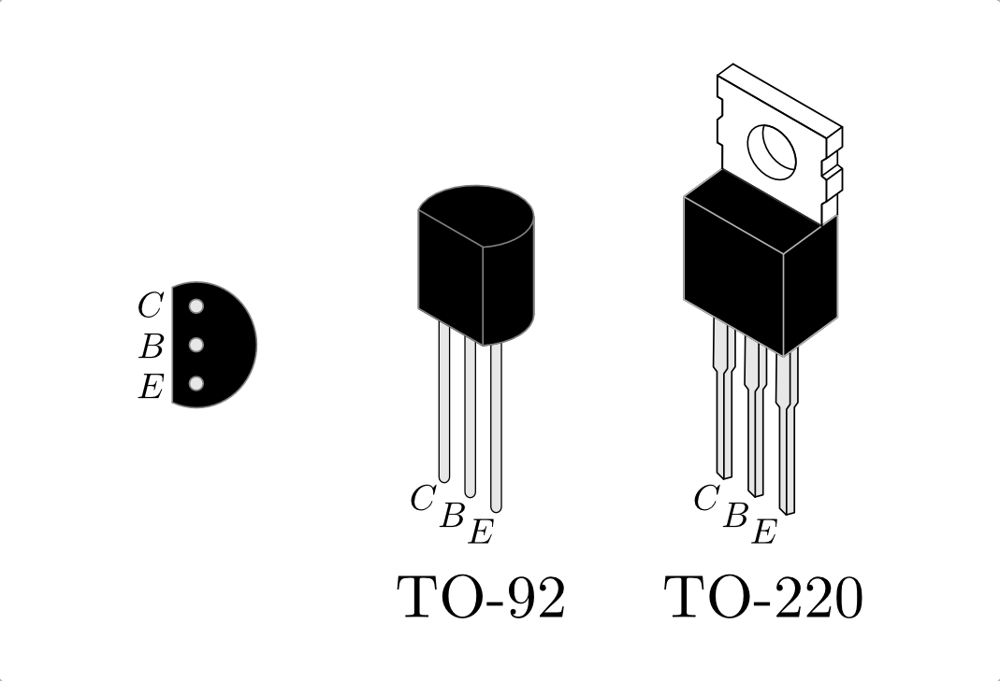
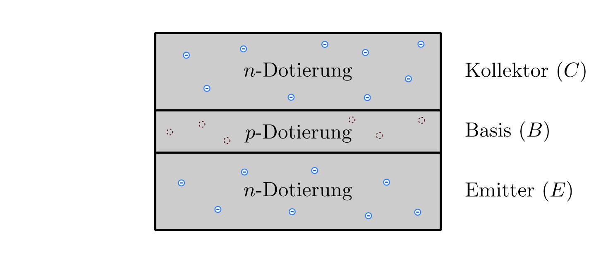
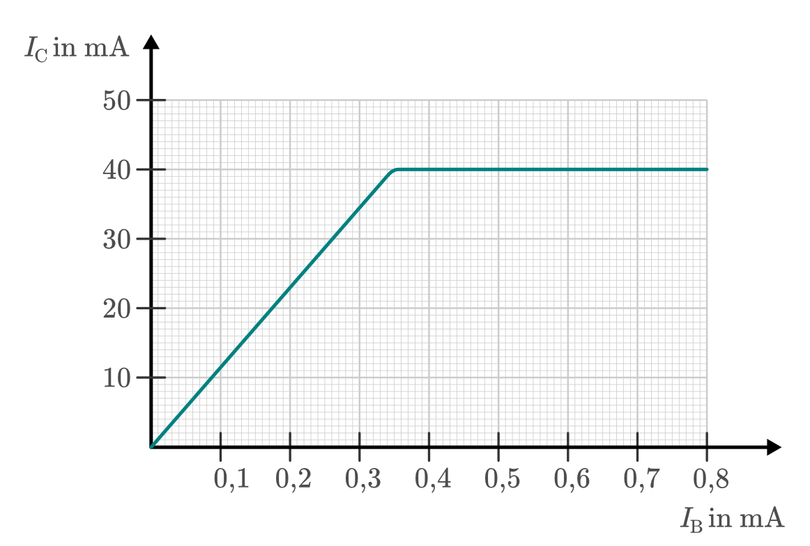

.. index::
    single: Transistor
.. _Transistor:

Transistoren
============

Transistoren sind Halbleiter-Bauteile, die als Schalter, Regler und Verstärker
vielerlei Anwendung finden.

Ein Transistor (Kurzwort für "transfer resistor") kann, je nach Schaltungsart,
tatsächlich wie ein elektrisch regelbarer Widerstand eingesetzt werden.
Grundsätzlich ähnelt ein Transistor allerdings vielmehr einer :ref:`Röhrentriode
<Röhrentriode>`, weshalb er auch als "Halbleiter-Triode" bezeichnet wird.
Transistoren werden insbesondere verwendet, um Ströme zu schalten, zu verstärken
oder zu steuern.

Im Elektronik-Selbstbau werden meist so genannte "bipolare" Transistoren
eingesetzt. Diese bestehen aus drei Halbleiterschichten, wobei je nach
Reihenfolge der Dotierungen zwischen :math:`npn`- und :math:`pnp`-Transistoren
unterschieden wird. Die drei an den Halbleiterschichten angebrachten Anschlüsse
eines bipolaren Transistors werden Kollektor :math:`\mathrm{C}`, Basis :math:`\mathrm{B}` und
Emitter :math:`\mathrm{E}` genannt. [#]_

    Bauformen von :math:`npn`-Transistoren. Bei :math:`pnp`-Transistoren sind
    :math:`\mathrm{C}` und :math:`\mathrm{E}` vertauscht.

    .. only:: html

        :download:`SVG: Bauformen von npn-Transistoren
        <../pics/bauteile/bauform-transistor-npn.svg>`

Neben den gewöhnlichen bipolaren Transistoren gibt es auch "unipolare"
Feldeffekttransistoren (FETs), die im Hobby-Bereich meist zum Steuern größerer
Stromstärken genutzt werden. In großen Stückzahlen bilden sie darüber hinaus die
wichtigsten Bestandteile von integrierten Schaltkreisen, beispielsweise
Operationsverstärkern oder Mikroprozessoren.

.. _npn-Transistor:

npn-Transistoren
----------------

Ein :math:`npn`-Transistor besteht aus drei aufeinander folgenden
Halbleiter-Schichten, wobei die beiden äußeren eine negative und die mittlere
Schicht eine positive Dotierung aufweisen; dies entspricht einem doppelten
:ref:`n-p-Übergang <n-p-Übergang>`. Nach außen sind alle Schichten mit
metallischen Anschluss-Kontakten verbunden.

    Innerer Aufbau eines :math:`npn`-Transistors.

    .. only:: html

        :download:`SVG: Aufbau npn-Transistor
        <../pics/bauteile/aufbau-transistor-npn.svg>`

Gewöhnlich verläuft der zu steuernde Hauptstrom zwischen dem Kollektor
:math:`\mathrm{C}` und dem Emitter :math:`(\mathrm{E})`. Die Wirkungsweise des
Transistors wird dabei durch die Stromstärke bestimmt, die durch die Basis
:math:`\mathrm{B}` fließt: [#]_

* Fließt durch die Basis :math:`\mathrm{B}` kein Strom, so ist die
  Kollektor-Emitter-Strecke :math:`\mathrm{CE}` des Transistors gesperrt. In seiner
  Wirkung entspricht er dabei einem unendlich großen Widerstand bzw. einem
  geöffneten Schalter.

* Fließt ein schwacher Strom durch die Basis :math:`\mathrm{B}`, so wird die
  Kollektor-Emitter-Strecke :math:`\mathrm{CE}` leitfähig. Je nach Art der
  Transistor-Schaltung entspricht die Wirkungsweise des Transistors einem
  elektrisch regelbaren Widerstand oder einer leitenden Verbindung (fast) ohne
  Widerstand.

    Schaltzeichen eines :math:`npn`-Transistors.

    .. only:: html

        :download:`SVG: Schaltzeichen npn-Transistor
        <../pics/bauteile/schaltzeichen-transistor-npn.svg>`

Da Transistoren sehr hohe Schaltfrequenzen (rund :math:`\unit[100]{MHz}`,
teilweise sogar noch mehr) zulassen, können beispielsweise auch
niedrig-frequente Spannungsimpulse eines Audio-Eingangs (:math:`\unit[20]{Hz}
\text{ bis } \unit[20]{kHz})` durch Anlegen an die Basis eines Transistors auf
dem erheblich größeren Kollektor-Emitter-Strom abgebildet bzw. verstärkt
werden. Der Verstärkungsfaktor eines einzelnen Transistors liegt, je nach
Bauart, bei rund :math:`100 \text{ bis } 500`; beispielsweise kann bei einem
Transistor mit einem Verstärkungsfaktor von :math:`300` ein Basis-Strom von
:math:`\unit[1]{mA}` einen Kollektor-Emitter-Strom von maximal
:math:`\unit[300]{mA} = \unit[0,3]{A}` steuern.

    Beispiel einer :math:`I_{\mathrm{C}}(I_{\mathrm{B}})`-Kennlinie eines
    Transistors.

    .. only:: html

        :download:`SVG: Transistor-Kennlinie
        <../pics/bauteile/diagramm-kennlinie-transistor.svg>`

Ist der durch die Basis fließende Strom groß genug, so ist der Transistor "in
Sättigung" -- zwischen Kollektor und Emitter fließt entsprechend der maximal
mögliche Strom; eine Verstärkung des Basis-Stroms führt zu keiner weiteren
Erhöhung des Kollektor-Emitter-Stroms. Der Transistor wirkt bei Anlegen
derartiger Basis-Spannungen vielmehr wie ein Schalter.

..  Noch höhere Basis-Spannungen werden folglich nicht weiter verstärkt, sondern
..  vielmehr obertonreich "abgeschnitten", z.B. wenn eine Mikrofon-Aufnahme
..  "übersteuert" wird.

.. Verstärker-Röhren haben einen weicheren Übergang in den
..  Sättigungsbereich, was zu Verzerrungen mit weniger Obertönen führt.

.. _pnp-Transistoren:

pnp-Transistoren
----------------

Ein :math:`pnp`-Transistor besteht ebenfalls aus drei aufeinander folgenden
Halbleiter-Schichten, wobei die beiden äußeren eine positive und die mittlere
Schicht eine negative Dotierung aufweisen.

    Schaltzeichen eines :math:`pnp`-Transistors.

    .. only:: html

        :download:`SVG: Schaltzeichen pnp-Transistor
        <../pics/bauteile/schaltzeichen-transistor-pnp.svg>`

Da die Schichten eines :math:`pnp`-Transistors im Vergleich zu einem
:math:`npn`-Transistor eine genau umgekehrte Dotierung aufweisen, muss auch der
Strom in die entgegengesetzte Richtung fließen. Im Schaltzeichen ist dies
dadurch gekennzeichnet, dass der Pfeil nicht von der Basis weg, sondern zur
Basis hin zeigt.

Hierzu gibt es folgende Merksprüche:

* :math:`npn`-Transistor:
    | "NPN means 'Not Pointing iN'", oder
    | "Naus, Pfeil 'naus!"
* :math:`pnp`-Transistor:
    | "PNP heißt 'Pfeil Nach Platte'", oder
    | "Tut der Pfeil der Basis weh, handelt sich's um PNP"

Entsprechend sind auch der Kollektor- und der Emitter-Anschluss eines
:math:`pnp`-Transistors im Vergleich zu einem :math:`npn`-Transistor vertauscht.

..  Foto-Transistor und Opto-Koppler
..  --------------------------------

.. raw:: html

    

.. only:: html

    .. rubric:: Anmerkungen:

.. [#]  Im Englischen wird die Basis in Anlehnung an das Gitter einer
        Röhrentriode als "gate" bezeichnet.

.. [#]  Ebenso wie der Kollektor-Strom :math:`\mathrm{CE}` fließt auch der
        Basis-Strom :math:`\mathrm{BE}` zum Emitter hin ab.

