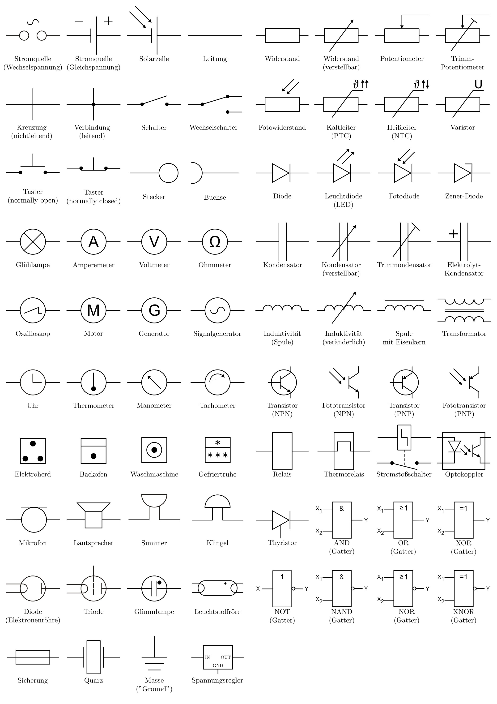

.. _Elektronische_Symbole:

Übersicht über elektronische Symbole
------------------------------------

In elektronischen Schaltplänen werden die verschiedenen Bauteile durch
entsprechende Symbole dargestellt. Die folgende Liste soll -- ohne Anspruch auf
Vollständigkeit -- einen Überblick über einige dieser "Schaltzeichen" bieten.

    Übersicht über häufige elektronische Schaltzeichen.

    .. only:: html
    
        :download:`SVG: Elektronische Symbole
        <../pics/bauteile/schaltzeichen-uebersicht.svg>`

..  
    http://de.wikipedia.org/wiki/Liste_der_Schaltzeichen_(Elektrik/Elektronik)
    http://de.wikipedia.org/wiki/Liste_elektronischer_Bauteile
    http://de.wikipedia.org/wiki/Logikgatter
