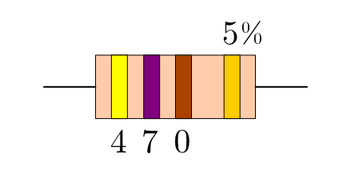

.. index:: Widerstand
.. _Widerstand:
.. _Widerstände:

Widerstände
===========

Das Wort "Widerstand" hat in der Elektronik eine zweifache Bedeutung. Zum einen
wird die den elektrischen Strom hemmende Eigenschaft von Materialien als
Widerstand bezeichnet; zum anderen wird mit "Widerstand" ein speziell zu diesem
Zweck gefertigtes Bauteil bezeichnet.

..
    Wird ein Widerstand von einem Strom durchflossen, so fällt an ihm eine
    Spannung ab, die sich nach dem Ohmschen Gesetz ergibt. U = R \cdot I

    Beispiel: :math:`R = \unit[20]{\Omega } ,\, I = \unit[4]{A} \quad
    \rightarrow \quad U = R \cdot I = \unit[80]{V}`

.. _Normale Widerstände:

"Normale" Widerstände
---------------------

Ein Widerstand besteht normalerweise aus einem isolierenden Porzellan-Körper,
der mit einer dünnen Kohle- oder Metallschicht und einem Schutzlack überzogen
ist. [#]_ Kohleschicht-Widerstände sind meist ockerfarben,
Metallschicht-Widerstände blau lackiert. Auf dem Schutzlack ist schließlich der
Widerstandswert in Form von farbigen Ringen aufgedruckt, um ihn auch ohne Lupe
und von allen Seiten gleichermaßen lesbar zu machen.

    Schaltzeichen eines Widerstandes (allgemein).

    .. only:: html

        :download:`SVG: Schaltzeichen Widerstand
        <../pics/bauteile/schaltzeichen-widerstand.svg>`

Kohle- und Metallschicht-Widerstände unterscheiden sich im Wesentlichen durch
ihre Toleranz-Werte, d.h. durch die mögliche Abweichung des tatsächlichen
Widerstandswertes vom aufgedruckten Wert. Metallschicht-Widerstände lassen sich
präziser fertigen und weisen somit eine geringere Toleranz (meist :math:`1\%`)
auf, sind dafür allerdings auch geringfügig teurer. Für die meisten Zwecke
reichen im Hobby-Bereich die günstigeren und etwas unpräziseren
Kohleschicht-Widerstände (meist :math:`5\%` oder :math:`10\%` Toleranz) völlig
aus.

.. _Notation von Widerstandswerten:

.. rubric:: Notation von Widerstandswerten

Widerstandswerte werden häufig mit zweierlei Besonderheiten angegeben:

1. Da die Werte von verschiedenen Widerständen sehr unterschiedlich sein können
   (von rund einem Ohm bis einigen Millionen Ohm), werden Widerstandswerte oft
   als :ref:`Zehnerpotenzen <Zehnerpotenzen>` angegeben, beispielsweise
   :math:`\unit[47]{k \Omega }` statt :math:`\unit[47\,000]{\Omega }`. Das
   :math:`\Omega`-Zeichen wird dabei sogar häufig weggelassen.
2. In Schaltplänen ist darüber hinaus als Schreibweise üblich, mögliche
   Nachkommastellen hinter den Potenzfaktor zu schreiben; ein Widerstandsangabe
   von :math:`2\mathrm{k}2` entspricht somit einem Widerstandswert von
   :math:`\unit[2,2]{k \Omega }` bzw. :math:`\unit[2\,200]{\Omega }`. Auf diese
   Weise kann ausgeschlossen werden, dass man eine Kommastelle aus Versehen
   "überlesen" könnte.

.. _Farb-Codierung:

.. rubric:: Farb-Codierung

Obwohl die Farben der aufgedruckten Farbringe stets die gleiche Bedeutung haben,
unterscheiden sich Kohle- und Metallschicht-Widerstände in der Anzahl der auf
ihnen aufgedruckten Ringe. Auf Kohleschicht-Widerständen werden, wie in Tabelle
:ref:`Farbtabelle (Kohleschicht-Widerstände)
<tab-farbtabelle-kohleschichtwiderstand>` aufgelistet, stets *vier* Ringe
aufgedruckt:

* Die ersten beiden Ringe stellen die ersten beiden Ziffern des
  Widerstandswertes dar.
* Der dritte Ring legt als Multiplikator die Anzahl der Nullen fest.
* Der vierte Ring, der bei Kohleschicht-Widerständen meist silbern oder golden
  ist, ist etwas nach rechts abgesetzt und gibt den Toleranzwert an; an seinem
  Abstand zu den übrigen Ringen kann man sich vergewissern, den Widerstandswert
  auch von der richtigen Seite her abzulesen.

.. list-table:: Farbtabelle (Kohleschicht-Widerstände)
    :name:  tab-farbtabelle-kohleschichtwiderstand
    :widths: 50 50 50 50 50 50

    * - Farbring
      - Farbe
      - \1. Ring
      - \2. Ring
      - \3. Ring
      - \4. Ring
    * -
      -
      - \1. Ziffer
      - \2. Ziffer
      - Nullen
      - Toleranz
    * - .. image:: ../pics/bauteile/widerstandsring-schwarz.png
      - schwarz
      -  :math:`0`
      -  :math:`0`
      -  ---
      -  ---
    * - .. image:: ../pics/bauteile/widerstandsring-braun.png
      - braun
      -  :math:`1`
      -  :math:`1`
      -  :math:`0`
      -  :math:`\pm 1\%`
    * - .. image:: ../pics/bauteile/widerstandsring-rot.png
      - rot
      -  :math:`2`
      -  :math:`2`
      -  :math:`00`
      -  :math:`\pm 2\%`
    * - .. image:: ../pics/bauteile/widerstandsring-orange.png
      - orange
      -  :math:`3`
      -  :math:`3`
      -  :math:`000`
      -  ---
    * - .. image:: ../pics/bauteile/widerstandsring-gelb.png
      - gelb
      -  :math:`4`
      -  :math:`4`
      -  :math:`0\,000`
      -  ---
    * - .. image:: ../pics/bauteile/widerstandsring-gruen.png
      - grün
      -  :math:`5`
      -  :math:`5`
      -  :math:`00\,000`
      -  :math:`\pm 0,5\%`
    * - .. image:: ../pics/bauteile/widerstandsring-blau.png
      - blau
      -  :math:`6`
      -  :math:`6`
      -  :math:`000\,000`
      -  ---
    * - .. image:: ../pics/bauteile/widerstandsring-violett.png
      - violett
      -  :math:`7`
      -  :math:`7`
      -  :math:`0\,000\,000`
      -  ---
    * - .. image:: ../pics/bauteile/widerstandsring-grau.png
      - grau
      -  :math:`8`
      -  :math:`8`
      -  :math:`00\,000\,000`
      -  ---
    * - .. image:: ../pics/bauteile/widerstandsring-weiss.png
      - weiß
      -  :math:`9`
      -  :math:`9`
      -  :math:`000\,000\,000`
      -  ---
    * - .. image:: ../pics/bauteile/widerstandsring-gold.png
      - gold
      -  ---
      -  ---
      -  ---
      -  :math:`\pm 5\%`
    * - .. image:: ../pics/bauteile/widerstandsring-silber.png
      - silber
      -  ---
      -  ---
      -  ---
      -  :math:`\pm 10\%`

Auf die präziseren Metallschicht-Widerstände werden, wie in Tabelle
:ref:`Farbtabelle (Metallschicht-Widerstände)
<tab-farbtabelle-metallschichtwiderstand>` wiedergegeben, stets *fünf* Ringe
aufgedruckt. Der Widerstandswert wird mit vier Ringen dargestellt, wobei die
ersten drei Ringe die ersten drei Ziffern des Widerstandswertes darstellen und
der vierte Ring als Multiplikator die Anzahl der anzufügenden Nullen angibt. Auf
diese Weise sind auch feinere Abstufungen der Widerstandswerte wie
beispielsweise :math:`\unit[4,7]{\Omega }` darstellbar.

.. list-table:: Farbtabelle (Metallschicht-Widerstände)
    :name:  tab-farbtabelle-metallschichtwiderstand
    :widths: 50 50 50 50 50 50 50

    * - Farbring
      - Farbe
      - \1. Ring
      - \2. Ring
      - \3. Ring
      - \4. Ring
      - \5. Ring
    * -
      -
      - \1. Ziffer
      - \2. Ziffer
      - \3. Ziffer
      - Nullen
      - Toleranz
    * - .. image:: ../pics/bauteile/widerstandsring-schwarz.png
      - schwarz
      -  :math:`0`
      -  :math:`0`
      -  :math:`0`
      -  ---
      -  ---
    * - .. image:: ../pics/bauteile/widerstandsring-braun.png
      - braun
      -  :math:`1`
      -  :math:`1`
      -  :math:`1`
      -  :math:`0`
      -  :math:`\pm 1\%`
    * - .. image:: ../pics/bauteile/widerstandsring-rot.png
      - rot
      -  :math:`2`
      -  :math:`2`
      -  :math:`2`
      -  :math:`00`
      -  :math:`\pm 2\%`
    * - .. image:: ../pics/bauteile/widerstandsring-orange.png
      - orange
      -  :math:`3`
      -  :math:`3`
      -  :math:`3`
      -  :math:`000`
      -  ---
    * - .. image:: ../pics/bauteile/widerstandsring-gelb.png
      - gelb
      -  :math:`4`
      -  :math:`4`
      -  :math:`4`
      -  :math:`0\,000`
      -  ---
    * - .. image:: ../pics/bauteile/widerstandsring-gruen.png
      - grün
      -  :math:`5`
      -  :math:`5`
      -  :math:`5`
      -  :math:`00\,000`
      -  :math:`\pm 0,5\%`
    * - .. image:: ../pics/bauteile/widerstandsring-blau.png
      - blau
      -  :math:`6`
      -  :math:`6`
      -  :math:`6`
      -  :math:`000\,000`
      -  ---
    * - .. image:: ../pics/bauteile/widerstandsring-violett.png
      - violett
      -  :math:`7`
      -  :math:`7`
      -  :math:`7`
      -  :math:`0\,000\,000`
      -  :math:`\pm 0,1\%`
    * - .. image:: ../pics/bauteile/widerstandsring-grau.png
      - grau
      -  :math:`8`
      -  :math:`8`
      -  :math:`8`
      -  :math:`00\,000\,000`
      -  ---
    * - .. image:: ../pics/bauteile/widerstandsring-weiss.png
      - weiß
      -  :math:`9`
      -  :math:`9`
      -  :math:`9`
      -  :math:`000\,000\,000`
      -  ---
    * - .. image:: ../pics/bauteile/widerstandsring-gold.png
      - gold
      -  ---
      -  ---
      -  ---
      -  :math:`0,1`
      -  :math:`\pm 5\%`
    * - .. image:: ../pics/bauteile/widerstandsring-silber.png
      - silber
      -  ---
      -  ---
      -  ---
      -  :math:`0,01`
      -  :math:`\pm 10\%`

*Beispiel:*

Ein häufig auftretender Widerstandswert ist :math:`\unit[470]{\Omega}` -- ein
Widerstand dieser Größe wird beispielsweise benötigt, um eine normale
Leuchtdiode an einer :math:`\unit[9]{V}`-Batterie bzw. einem entsprechenden Akku
anzuschließen (siehe :ref:`Leuchtdiode mit Vorwiderstand`). Angenommen, dass es
sich um einen Kohleschicht-Widerstand handelt, so entspricht die erste Ziffer
:math:`(4)` einem gelben Ring, die zweite Ziffer :math:`(7)` einem violetten. An
den so codierten Wert :math:`(47)` muss noch eine Null angehängt werden; dies
lässt sich erreichen, indem der dritte Ring in brauner Farbe aufgedruckt wird.

    Farbringe eines :math:`\unit[470]{\Omega }`-Widerstands.

    .. only:: html

        :download:`SVG: Farbringe-Beispiel (470 Ohm)
        <../pics/bauteile/widerstand-farbringe-beispiel-470-ohm.svg>`

Ist der vierte Ring des Kohlenschicht-Widerstandes goldfarben, so ist eine
Toleranz von :math:`5\%` erlaubt -- der tatsächliche Wert des Widerstands
liegt somit zwischen :math:`\unit[446,5]{\Omega }` und :math:`493,5` Ohm.

.. todo::

    Belastbarkeit von Widerstaenden
    Widerstandsreihe http://www.elektronik-kompendium.de/sites/bau/1109071.htm

.. index::
    single: Widerstand; Fotowiderstand

.. _Fotowiderstand:

Fotowiderstände
---------------

Fotowiderstände -- auch "LDR" (Light Dependend Resistor) genannt -- haben, wenn
sie voll beleuchtet werden, einen Widerstand von einigen hundert
:math:`\unit[]{\Omega}`. Bei sinkender Lichtintensität steigt der Widerstand --
je nach Bauart -- bis auf einige :math:`\unit[]{M \Omega}` an.

    Schaltzeichen eines Fotowiderstandes.

    .. only:: html

        :download:`SVG: Schaltzeichen Fotowiderstand
        <../pics/bauteile/schaltzeichen-widerstand-fotowiderstand.svg>`

Die Widerstandsänderung eines Fotowiderstands geschieht vergleichsweise langsam;
sie kann mit Hilfe eines Ohmmeters bei verschiedenen Beleuchtungsstärken leicht
beobachtet werden. Gleichzeitig sind Fotowiderstände aufgrund ihrer "Trägheit"
nicht für schnelle optische Signalübertragungen (z.B. Infrarot-Fernbedienungen)
geeignet. Hierfür werden vielmehr Fotodioden und Fototransistoren eingesetzt.

.. _Temperaturabhängige Widerstände:

Temperaturabhängige Widerstände
--------------------------------

Fast alle elektrischen Bauteile weisen bei höheren Temperaturen auch einen
meist geringfügig höheren Widerstand auf; es gibt allerdings auch
(Halbleiter-)Materialien, bei denen diese Temperaturabhängigkeit sehr stark
ausgeprägt ist. Als spezielle Widerstände werden diese besonderen Materialien
häufig als Temperatur-Sensoren eingesetzt.

.. index:: PTC-Widerstand

.. rubric:: PTC-Widerstände

Als "Kaltleiter" oder PTC-Widerstand ("PTC" = "Positive Temperature
Coefficient") werden Stoffe bezeichnet, deren Widerstand bei steigenden
Temperaturen zunimmt.

    Schaltzeichen eines Kaltleiters (PTC).

    .. only:: html

        :download:`SVG: Schaltzeichen Kaltleiter (PTC)
        <../pics/bauteile/schaltzeichen-widerstand-kaltleiter.svg>`

.. index:: NTC-Widerstand

.. rubric:: NTC-Widerstände

Als "Heißleiter" oder NTC-Widerstand ("NTC" = "Nositive Temperature
Coefficient") werden Stoffe bezeichnet, deren Widerstand bei steigenden
Temperaturen abnimmt.

..  The value of an NTC (e.g. 10k)  is usually given at an ambient temperature of 25 degrees Celsius.

    Schaltzeichen eines Heißleiters (NTC).

    .. only:: html

        :download:`SVG: Schaltzeichen Heißleiter (NTC)
        <../pics/bauteile/schaltzeichen-widerstand-heissleiter.svg>`

.. _Regelbare Widerstände:

Regelbare Widerstände
---------------------

Ein regelbarer Widerstand ist ein Widerstand, dessen Widerstandswert über einen
Schleifkontakt (meist) von null bis zum angegebenen Höchstwert verändert werden
kann. Dabei unterscheidet man zwischen auch im laufenden Betrieb regelbaren
Potentiometern und fest einstellbaren Trimmwiderständen.

.. index::
    single: Widerstand; Potentiometer
    single: Potentiometer
.. _Potentiometer:

.. rubric:: Potentiometer

Ein Potentiometer (kurz: "Poti") ermöglicht eine Einstellung des
Widerstandswertes von außen mit Hilfe eines Drehknopfes oder Schiebers.

Jedes Potentiometer besitzt drei Anschlüsse, wobei zwischen den beiden äußeren
Anschlüssen der auf dem Potentiometer angegebene Widerstandswert in voller Höhe
auftritt. Wird ein Ende und der mittlere Abgriff des Potentionmeters mit dem
Stromkreis verbunden, so kann der Widerstand mit Hilfe des Drehknopfes zwischen
null und dem maximalen Wert verändert werden.

    Schaltzeichen eines Potentiometers.

    .. only:: html

        :download:`SVG: Schaltzeichen Potentiometer
        <../pics/bauteile/schaltzeichen-widerstand-potentiometer.svg>`

Potentiometer finden häufig Einsatz als Dreh- bzw. Schieberegler, beispielsweise
bei der Einstellung der Lautstärke an einem Radio.

.. Schaltpoti..

.. _Trimmwiderstand:
.. index::
    single: Widerstand; Trimmwiderstand
    single: Trimmwiderstand

.. rubric:: Trimmwiderstände

Ein Trimmwiderstand ("Einstellpoti") kann nur mit Hilfe eines Schraubenziehers
justiert werden. Da Trimmwiderstände meist fest verbaute Bestandteile einer
Schaltung sind, ist eine Nachjustierung im laufenden Betrieb normalerweise nicht
vorgesehen.

    Schaltzeichen eines Trimmwiderstands.

    .. only:: html

        :download:`SVG: Schaltzeichen Trimmwiderstand
        <../pics/bauteile/schaltzeichen-widerstand-trimmwiderstand.svg>`

.. Einsatzgebiet:

.. raw:: html

    

.. only:: html

    .. rubric:: Anmerkungen:

.. [#]  Früher waren auch Masse- und Drahtwiderstände weit verbreitet.

    * Bei Massewiderständen bildet ein stabförmige Körper, der aus einem
      Gemisch an leitenden und nichtleitenden Stoffen besteht, den
      Widerstand. Der Widerstandswert hängt von der Art und der Dicke des
      verwendeten Materials ab.
    * Bei einem Drahtwiderstand wird ein langer Draht auf ein isolierendes
      Keramik-Röhrchen aufgewickelt und an beiden Enden festgeklemmt. Der
      Widerstandswert hängt von der Art des Metalls, seiner Dicke und seiner
      Länge ab.

    Gegenüber diesen Widerstandstypen haben Schichtwiderstände den Vorteil,
    dass sie kostengünstiger und in kleineren Bauformen herstellbar sind.
    Masse- und Drahtwiderstände werden heutzutage nur noch in
    Hochlast-Bereichen (ab ca. :math:`\unit[4]{W}`) eingesetzt, in denen die
    kleinen Kohle- und Metallschichtwiderstände durch eine zu hohe
    Wärme-Entwicklung zerstört würden.

.. raw:: html

    

.. hint::

    Zu diesem Abschnitt gibt es :ref:`Übungsaufgaben <Aufgaben zu
    Widerständen>`.

.. :ref:`Versuche <Versuche zu Widerständen>`

