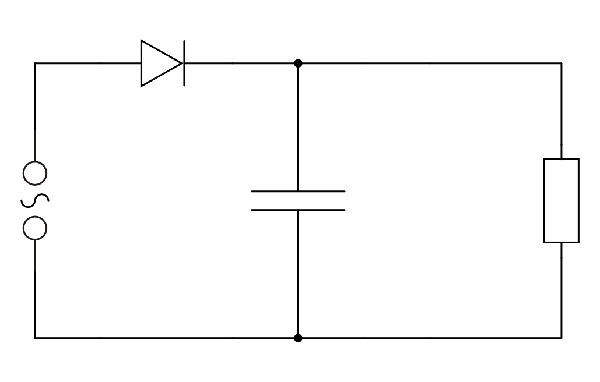
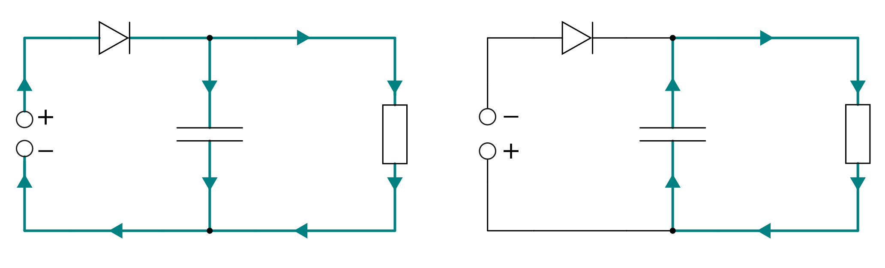
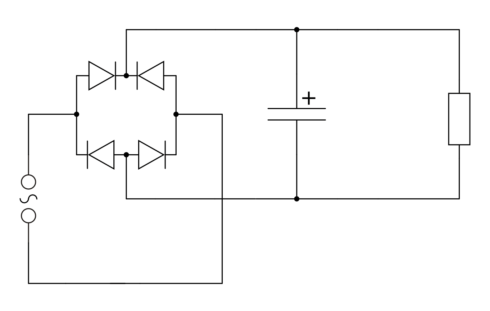
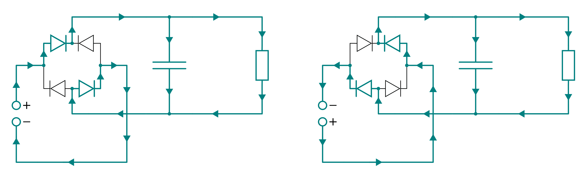

.. _Gleich- und Wechselrichter:

Gleich- und Wechselrichter
==========================

An haushaltsüblichen Steckdosen liegt eine Wechselspannung mit einer effektiven
Spannung von :math:`U _{\rm{eff}} = \unit[230]{V}` an. Diese Spannung kann mit
eingebauten oder externen Transformatoren ("Netzteilen") leicht auf den
gewünschten Spannungswert angepasst werden.

Viele elektronische Bauteile (beispielsweise Elektrolytkondensatoren, LEDs bzw.
Dioden und Transistoren) sind jedoch nicht auf den Betrieb mit Wechselspannung
bzw. Wechselstrom ausgelegt. Zum Betrieb von Schaltungen mit derartigen
Bauteilen muss die Wechselspannung in eine entsprechend große Gleichspannung
umgewandelt werden. Dies geschieht mit so genannten Gleichrichtern.

Umgekehrt kann eine Gleichspannung auch in eine Wechselspannung umgewandelt
werden. Dies ist beispielsweise im Radio- und Fernsteuerungs-Bereich nötig, um
Lautsprecher oder Lichtschranken mit bestimmten Spannungsfrequenzen anzusteuern.
Eine weitere Anwendung ergibt sich im Photovoltaik-Bereich, wo man die von
Solarzellen bereitgestellte Gleichspannung häufig in das allgemeine Stromnetz
einspeisen möchte. Allgemein werden derartige Schaltungen, die eine
Gleichspannung in eine entsprechend große Wechselspannung umwandeln,
Wechselrichter genannt.

Gleichrichter-Schaltungen
-------------------------

Gleichrichter wandeln Wechselspannung in Gleichspannung um. Dazu sind Bauteile
nötig, die den Strom nur in einer Richtung passieren lassen und in der anderen
Richtung sperren. Früher wurden zu diesem Zweck Elektronenröhren eingesetzt,
inzwischen werden fast ausschließlich Halbleiter-Dioden verwendet.

Die folgenden Schaltungen setzen zum sicheren Experimentieren eine
Wechselspannung von ungefähr :math:`\unit[9]{V} < U _{\rm{eff}} < \unit[12]{V}`
voraus, wie sie von Labornetzteilen bereitgestellt wird. [#]_

Der Einweg-Gleichrichter
^^^^^^^^^^^^^^^^^^^^^^^^

Am einfachsten lässt sich ein Gleichrichter durch die folgende Schaltung
realisieren:

    Schaltplan eines Einweg-Gleichrichters.

    .. only:: html

        :download:`SVG: Einweg-Gleichrichter
        <../pics/schaltungen/gleichrichter-einweg.svg>`

Die Schaltung funktioniert folgendermaßen:

* Liegt am oberen Pol der Wechselspannungsquelle eine positive Spannung an, so
  leitet die Diode. Der Kondensator lädt sich vollständig auf, gleichzeitig
  fließt Strom durch den Lastwiderstand.
* Liegt am unteren Pol der Wechselspannungsquelle eine positive Spannung an, so
  sperrt die Diode. Der Kondensator entlädt sich und hält so den Stromfluss
  durch den Lastwiderstand kurzzeitig aufrecht.

    Stromfluss im Einweg-Gleichrichter in Abhängigkeit von der Polung der
    Stromquelle.

    .. only:: html

        :download:`SVG: Einweg-Gleichrichter (Funktionsweise)
        <../pics/schaltungen/gleichrichter-einweg-funktionsweise.svg>`

Ist der Lastwiderstand sehr groß, so kann nur eine sehr geringe Stromstärke
auftreten. Der Kondensator entlädt sich folglich nur langsam und kann die
Nennspannung bis zum nächsten Umpolen (weitgehend) aufrecht erhalten. In der
Praxis ist der Lastwiderstand begrenzt, so dass die am Lastwiderstand anliegende
Spannung zwischenzeitlich stark, eventuell sogar auf null absinken kann.

..  Einweggleichrichter werden häufig als Demodulatoren in Empfangsschaltungen
..  der Kommunikationstechnik eingesetzt. Darin wird die benötigte Leistung durch
..  einen nach geschalteten Verstärker erreicht.

Der Zweiweg-Gleichrichter
^^^^^^^^^^^^^^^^^^^^^^^^^

Durch den Einsatz von vier Dioden lassen sich -- anders als beim
Einweg-Gleichrichter -- beide Polungen der Stromquelle, d.h. beide Halbbögen
der sinusförmigen Wechselspannung nutzen. Der grundlegende Schaltplan sieht
folgendermaßen aus:

    Schaltplan eines Zweiweg-Gleichrichters.

    .. only:: html

        :download:`SVG: Zweiweg-Gleichrichter
        <../pics/schaltungen/gleichrichter-zweiweg.svg>`

Die Schaltung funktioniert folgendermaßen:

* Liegt am oberen Pol der Wechselspannungsquelle eine positive Spannung an, so
  fließt im :ref:`Stromfluss-Diagramm eines Zweiweg-Gleichrichters
  <fig-gleichrichter-zweiweg-funktionsweise>` (linkes Bild) Strom durch die obere
  linke Diode zum Kondensator bzw. Lastwiderstand und über die untere rechte
  Diode zum unteren Pol der Wechselspannungsquelle zurück.

* Liegt am unteren Pol der Wechselspannungsquelle eine positive Spannung an, so
  fließt im :ref:`Stromfluss-Diagramm eines Zweiweg-Gleichrichters
  <fig-gleichrichter-zweiweg-funktionsweise>` (rechtes Bild) Strom durch die obere
  rechte Diode zum Kondensator bzw. Lastwiderstand und über die untere linke
  Diode zum oberen Pol der Wechselspannungsquelle zurück.

    Stromfluss im Zweiweg-Gleichrichter in Abhängigkeit von der Polung der
    Stromquelle.

    .. only:: html

        :download:`SVG: Zweiweg-Gleichrichter (Funktionsweise)
        <../pics/schaltungen/gleichrichter-zweiweg-funktionsweise.svg>`

Als Ausgangsspannung entsteht eine pulsierende Gleichspannung, die wie beim
Einweg-Gleichrichter durch den Kondensator mehr oder weniger geglättet wird.

Zweiweg-Gleichrichter werden oftmals in Netzteilen für elektronische Kleingeräte
eingesetzt. Die besondere Anordnung der vier Dioden, auch "Grätz-Schaltung"
genannt, gibt es auch als fertiges Bauelement ("Brückengleichrichter") zu
kaufen.

.. todo::

    Pic Brueckengleichrichter

    Spannungsverlust von 1,5 V beim Brückengleichrichter (wo die
    Sekundärspannung immer über zwei Gleichrichterdioden gleichzeitig fließen
    muss).

.. _Wechselrichter-Schaltungen:

Wechselrichter-Schaltungen
--------------------------

Wechselrichter wandeln Gleichspannung in Wechselspannung um. Hierzu werden
Polwechsler eingesetzt, die mit einer bestimmten Frequenz die Pole der
Eingangs-Gleichspannung abwechselnd mit den Ausgängen (z.B. Buchsen) verbinden.

Im einfachsten Fall ist der Polwechsler ein Wechselschalter, der von Hand oder
elektronisch mit Hilfe eines Relais betätigt wird. Die Frequenz der
Wechselspannung entspricht hierbei der Schaltfrequenz des Polwechslers.

.. only:: html

    .. rubric:: Anmerkung:

.. [#]  Niemals mit Netzstrom aus der Steckdose experimenteren, das ist lebensgefährlich!

.. todo::

    spannungswandler http://de.wikipedia.org/wiki/DC-DC-Wandler
    pulsweitenmodulation http://de.wikipedia.org/wiki/Pulsweitenmodulation

