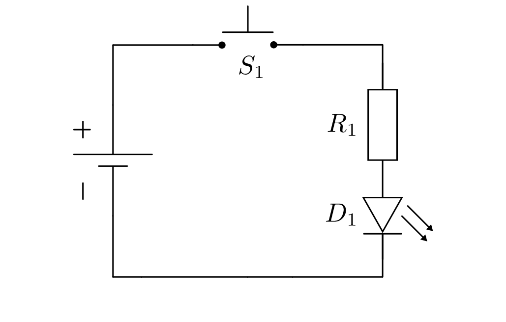
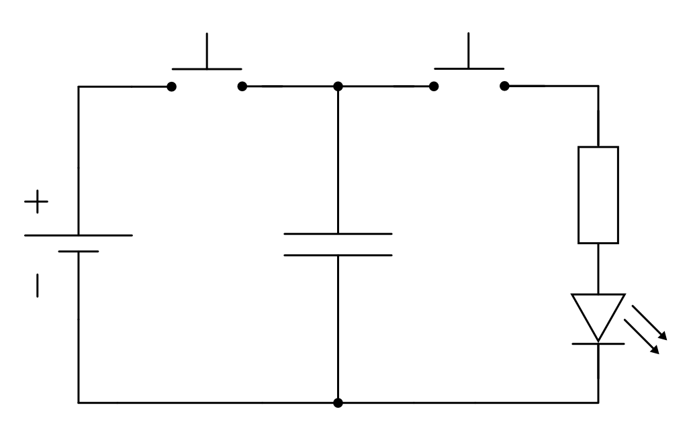
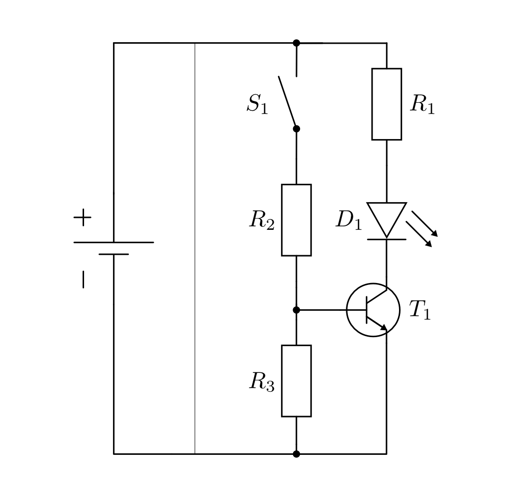
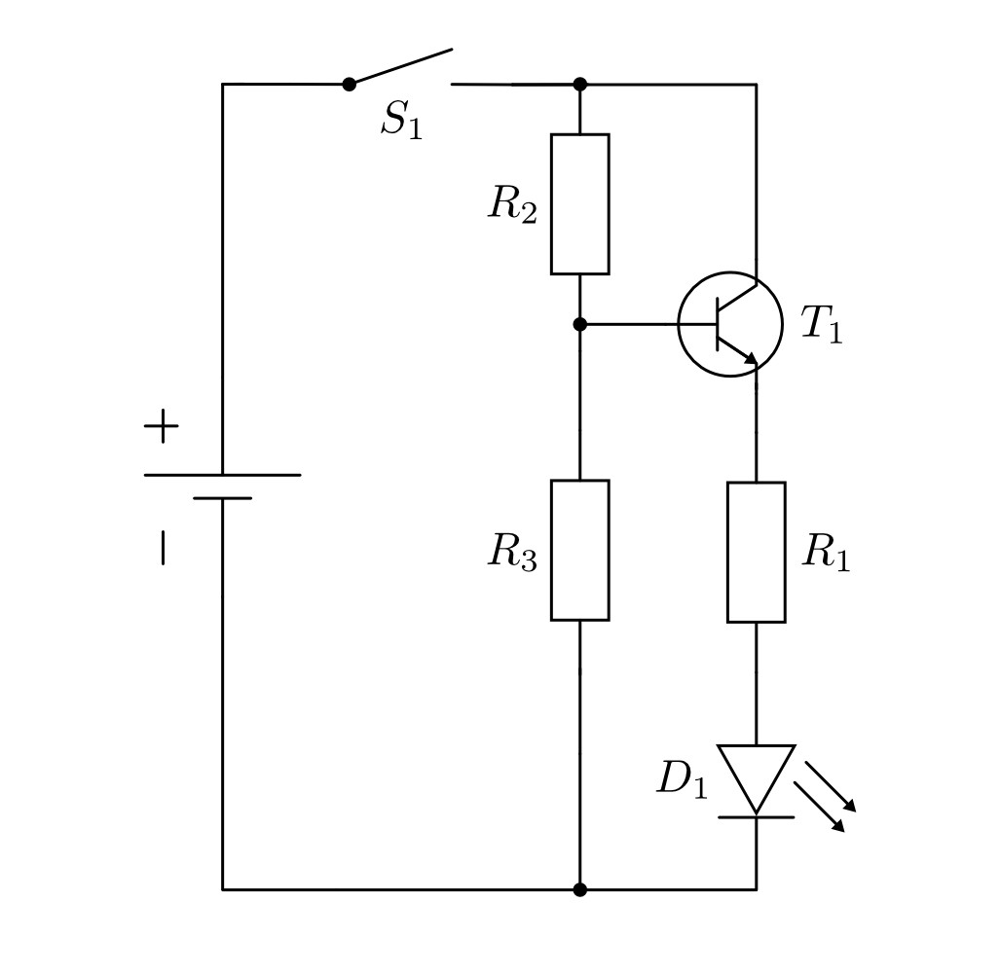

.. _Grundschaltungen:

Grundschaltungen
================

Die folgenden Schaltungen dienen dem Kennenlernen der einzelnen Bauteile und
ihrer Grundfunktionen. Zum Betrieb wird stets eine :math:`\unit[9]{V}`-
Gleichspannung benötigt, wie sie von einem Labornetzteil, einer Blockbatterie,
oder näherungsweise auch von einem wiederaufladbaren und daher
umweltfreundlicheren Block-Akku bereitbestellt wird.

.. _Leuchtdiode mit Vorwiderstand:

Leuchtdiode mit Vorwiderstand
-----------------------------

:ref:`Leuchtdioden <Leuchtdiode>` ("LEDs") werden beim Experimentieren gerne
eingesetzt, um auf den ersten Blick zu erkennen, ob an einer bestimmten Stelle
Strom fließt oder nicht. Damit eine Leuchtdiode mit "normaler" Helligkeit
aufleuchtet, benötigt sie eine Gleichspannung von rund :math:`U =
\unit[1,4]{V}`. 

Da zu hohe Spannungen (:math:`U > \unit[2,5]{V}`) das Bauteil gefährden können,
schaltet man vor eine Leuchtdiode :math:`D` meist einen so genannten
Vorwiderstand :math:`R`, der einen entsprechenden Spannungsabfall gegenüber der
Stromquelle bewirkt.

    Schaltung einer LED mit Vorwiderstand.

    .. only:: html
    
        :download:`SVG: LED mit Vorwiderstand
        <../pics/schaltungen/led-mit-vorwiderstand.svg>`

Bei einer Versorgungsspannung von :math:`U = \unit[9]{V}` muss am Vorwiderstand
eine Spannung von :math:`U _{\rm{R}} = \unit[7,6]{V}` abfallen, um eine typische
Betriebsspannung von :math:`U _{\rm{LED}} = \unit[1,4]{V}` an der Leuchtdiode zu
erreichen. Beträgt der Wert des Vorwiderstandes beispielsweise :math:`R =
\unit[470]{\Omega }`, so ergibt sich nach dem Ohmschen Gesetz ein Stromfluss
durch den Widerstand von:

.. math::
    
    I = \frac{U _{\rm{R}}}{R} = \frac{\unit[7,6]{V}}{\unit[470]{\Omega }} =
    \unit[0,016]{A} = \unit[16]{mA}
    
Der gleiche Strom fließt, da der Vorwiderstand und die Leuchtdiode als
Reihenschaltung vorliegen, auch durch die LED. Bei kleineren Vorwiderständen
ergeben sich entsprechend höhere Stromstärken bzw. an der Leuchtdiode anliegende
Spannungen, wobei die Herstellerangaben zu beachten sind, um ein "Durchglühen"
der Leuchtdiode zu verhindern. Bei kleineren Versorgungsspannungen oder größeren
Vorwiderständen lassen sich Leuchtdioden beliebig dimmen; hierzu kann man am
einfachsten ein Potentiometer in Reihe zum Vorwiderstand schalten. 

Man kann in Schaltung :ref:`LED mit Vorwiderstand <fig-led-mit-vorwiderstand>`
den Taster :math:`S _{\rm{1}}` auch durch zwei offene Leiterenden ersetzen, um
einen "Durchgangsprüfer" zu erhalten. Hält man diese an die Kontaktstellen
eines anderen leitenden Bauteils, z.B. an einen (nicht zu großen) Widerstand,
eine andere Leuchtdiode oder an ein Glühbirnchen, so leuchtet die Leuchtdiode
:math:`D _{\rm{1}}` auf, wenn das Bauteil intakt ist. Bei zu großen
Widerständen oder unterbrochenen Kontaktstellen -- beispielsweise einem
intakten Kondensator oder einer durchgebrannten Sicherung -- bleibt :math:`D
_{\rm{1}}` dunkel.

.. _Kondensator-Grundfunktion:

Kondensator-Grundfunktion
-------------------------

Kondensatoren haben die Fähigkeit elektrische Ladung zu speichern und sie
langsam wieder abzugeben. Eine einfache Schaltung, die diese Funktionsweise
veranschaulicht, ist folgende: 

    Grundfunktion eines Kondensators

    .. only:: html
    
        :download:`SVG: Kondensator-Grundfunktion
        <../pics/schaltungen/kondensator-grundfunktion.svg>`

Die Schaltung funktioniert folgendermaßen:

* Betätigt man nur den linken Taster, so lädt sich der Kondensator auf. Ist er
  vollständig geladen, fließt (fast) kein weiterer Strom. [#]_
* Betätigt man nur den rechten Taster, so kann sich der Kondensator über die
  Leuchtdiode und ihren Vorwiderstand entladen. Die LED leuchtet kurzzeitig auf,
  wobei ihre Leuchtstärke ebenso wie der Entladestrom des Kondensators
  beständig abnimmt.

Betätigt man beide Taster, oder sind keine Taster vorhanden, so wird der
Kondensator geladen und die LED leuchtet. Wird die Stromquelle abgetrennt, so
erlischt die LED je nach Kapazität des eingebauten Kondensators mehr oder
weniger schnell.

.. _Transistor-Grundschaltungen:

Transistor-Grundschaltungen
---------------------------

Ein Transistor kann, je nach Schaltungsart, als elektronischer Schalter oder als
regelbarer Verstärker eingesetzt werden. 

.. index:: Transistor; Emitterschaltung
.. _Die Emitterschaltung:

.. rubric:: Die Emitterschaltung

Bei der so genannten Emitter-Schaltung ist der Emitter des Transistors direkt
mit dem ``-``-Pol der Stromquelle verbunden. In dieser Position funktioniert der
Transistor als elektronischer Schalter, wobei sich der zu schaltende Teil des
Stromkreises vor dem Kollektor-Anschluss befindet. 

    Emitterschaltung eines Transistors.

    .. only:: html
    
        :download:`SVG: Emitterschaltung eines Transistors
        <../pics/schaltungen/transistor-emitterschaltung.svg>`

Ist in der :ref:`Emitterschaltung eines Transistors
<fig-transistor-emitterschaltung>` der Schalter :math:`S _{\rm{1}}` geöffnet, so
sperrt der Transistor :math:`T _{\rm{1}}`, und die Leuchtdiode :math:`D
_{\rm{1}}` bleibt dunkel. Schließt man den Schalter :math:`S _{\rm{1}}`, so
fließt ein schwacher Strom durch den Basiswiderstand :math:`R _{\rm{2}}` -- der
einen um ein Vielfaches größeren Widerstandswert als der Lastwiderstand :math:`R
_{\rm{1}}` besitzen darf -- an die Basis von :math:`T _{\rm{1}}`. [#]_ Die
Kollektor-Emitter-Strecke des Transistors leitend, der Transistor "steuert
durch". 

Ein schwacher Basis-Strom :math:`I _{\rm{B}}` kann auf diese Weise einen
Kollektor-Emitter-Strom :math:`I _{\rm{CE}}` schalten, der je nach Bautyp des
Transistors etwa :math:`100` bis :math:`500` mal größer sein kann. [#]_ Zwischen
Basis und Emitter stellt sich dabei, solange der Transistor durchgesteuert
bleibt, eine Spannung von rund :math:`\unit[0,7]{V}` ein.

.. index:: Transistor; Kollektorschaltung
.. _Die Kollektorschaltung:

.. rubric:: Die Kollektorschaltung

Bei der so genannten Kollektor-Schaltung ist der Kollektor des Transistors mit
dem ``+``-Pol der Stromquelle verbunden. In dieser Position funktioniert der
Transistor als regelbarer Verstärker. Eine variierende Basis-Stromstärke
:math:`I _{\rm{B}}` führt dabei, je nach Bautyp des Transistors, zu einer
etwa :math:`100` bis :math:`500` mal größeren Stromstärke im Verbraucher, der
sich hinter dem Emitter-Anschluss befindet.

    Kollektorschaltung eines Transistors.

    .. only:: html
    
        :download:`SVG: Kollektorschaltung eines Transistors
        <../pics/schaltungen/transistor-kollektorschaltung.svg>`

Das Funktionsprinzip der :ref:`Kollektorschaltung eines Transistors
<fig-transistor-kollektorschaltung>` liegt darin, dass sich die hinter dem
Widerstand :math:`R _{\rm{2}}` an der Basis anliegende Spannung :math:`U
_{\rm{in}}` in die Basis-Emitter-Spannung :math:`U _{\rm{BE}} \approx
\unit[0,7]{V}` *und* die am Verbraucher abfallende Spannung :math:`U _{\rm{R
_{\rm{1}}}}` aufteilt. Die Basis-Emitter-Stromstärke :math:`I _{\rm{BE}}` und
die Stromstärke im Verbraucher sind somit unmittelbar aneinander gekoppelt; umso
größer :math:`I _{\rm{BE}}` ist, desto größer ist (mit entsprechender
Verstärkung) auch :math:`I _{\rm{R _{\rm{1}}}}`.

.. raw:: html

    

.. only:: html

    .. rubric:: Anmerkungen:

.. [#]  Da es keinen perfekten Isolator gibt, weisen Kondensatoren stets eine
        gewisse Selbstentladung auf, wobei Ladung von der einen Plattenseite zur
        anderen fließt. Ist der Kondensator noch mit einer Stromquelle
        verbunden, so fließt diese Ladung von der Stromquelle auf den
        Kondensator nach. 

.. [#]  Der Widerstand :math:`R _{\rm{3}}` hat lediglich die Aufgabe, die durch
        die Basis-Emitter-Strecke fließende Stromstärke :math:`I _{\rm{BE}}` zu
        begrenzen; häufig wählt man dabei einen Widerstandswert, der etwa halb
        so groß ist wie :math:`R _{\rm{2}}`.

.. [#]  Bei einem Basis-Strom von nur :math:`I _{\rm{B}} \approx \unit[0,1]{\mu
        A}` wäre (bei einer rund :math:`300`-fachen Stromverstärkung) ein
        Kollektor-Emitter-Strom von :math:`I _{\rm{CE}} \approx \unit[30]{mA}`
        möglich, bei höheren Basis-Strömen sogar entsprechend mehr. Durch die
        Leuchtdiode fließt bei normaler Helligkeit allerdings nur
        ein Strom von etwa :math:`\unit[0,15]{mA}`. Der Transistor ermöglicht somit einen
        größeren Stromfluss als nötig -- er "übersteuert". Bei Schaltvorgängen
        ist dies durchaus erwünscht, denn somit ist das Einschalten des
        eigentlichen Verbrauchers (hier: LED mit Vorwiderstand) auf alle Fälle
        sichergestellt.

.. raw:: html

    

.. hint:: 

    Zu diesem Abschnitt gibt es :ref:`Übungsaufgaben <Aufgaben zu
    Grundschaltungen>`.
    

