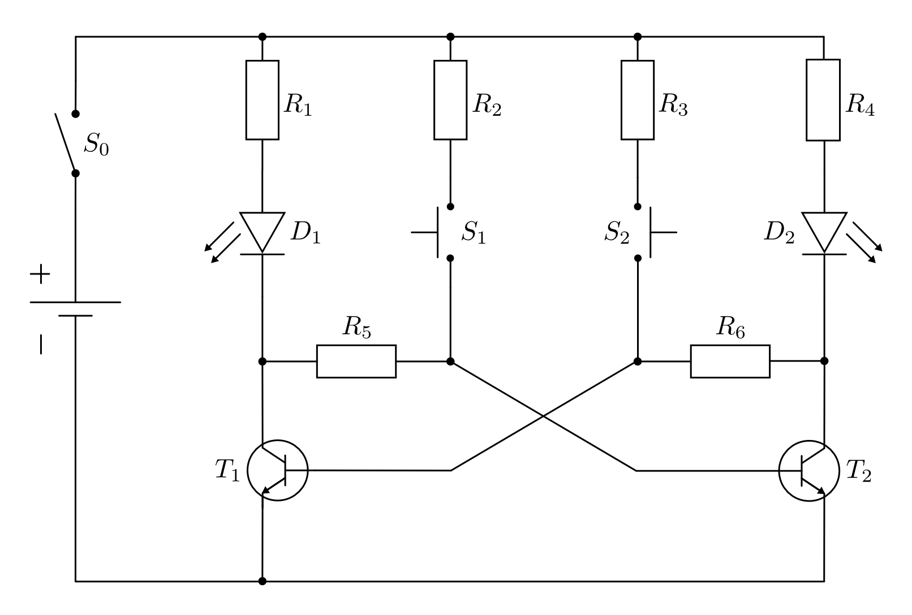
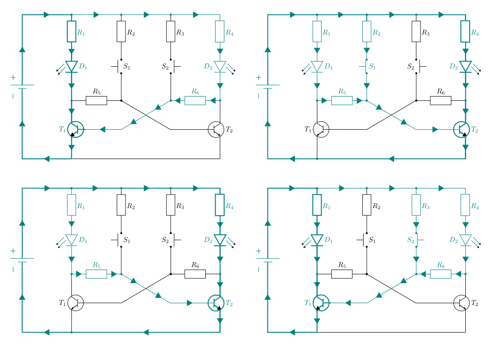
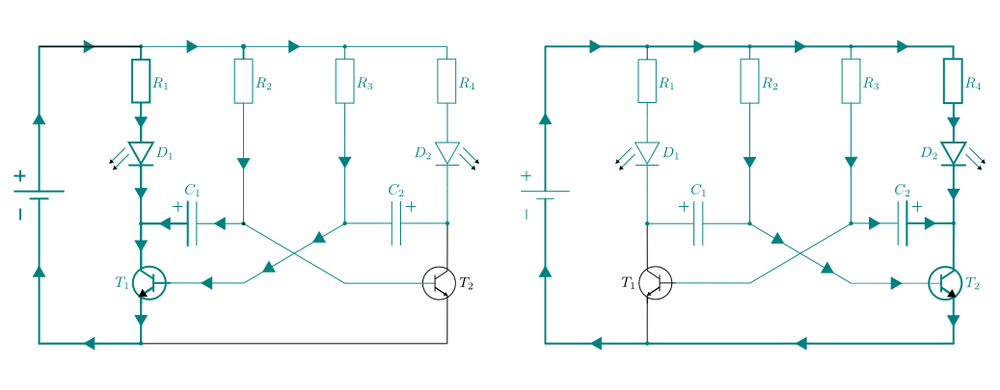
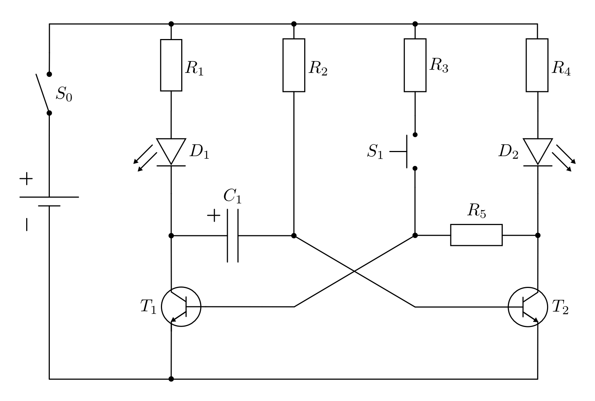

.. index:: Kippschaltung
.. _Kipp-Schaltungen:

Kipp-Schaltungen
================

.. index::
    single: Kippschaltung; bistabil
.. _Die bistabile Kippschaltung:

Die bistabile Kippschaltung
---------------------------

Eine bistabile Kippschaltung (auch "Flip-Flop" genannt) hat zwei stabile
Zustände, zwischen denen durch Betätigung eines Schalters hin- und hergewechselt
werden kann.

    Schema einer bistabilen Kippschaltung.

    .. only:: html

        :download:`SVG: Bistabile Kippschaltung
        <../pics/schaltungen/kippschaltung-bistabil.svg>`

Wird der Hauptschalter :math:`S_{\rm{0}}` im :ref:`Schema einer bistabilen
Kippschaltung <fig-kippschaltung-bistabil>` geschlossen, so fließen schwache
Ströme über die (starken) Widerstände :math:`R_5` und :math:`R_6` zu den
Basis-Anschlüssen der Transistoren :math:`T_1` und :math:`T_2`. [#]_ Welcher der
Transistoren dabei als erster schaltet, hängt von den konkreten
Bauteil-Eigenschaften ab.

* Schaltet der Transistor :math:`T_1`, so wird seine Kollektor-Emitter-Strecke
  leitend. Damit fließt ein starker Strom, der im Wesentlichen durch den
  Vorwiderstand :math:`R_1` der LED :math:`D_1` begrenzt wird, zum Minuspol der
  Stromquelle. Da kein Strom mehr durch den Widerstand :math:`R_5` fließt,
  sperrt der Transistor :math:`T_2`. [#]_ Der schwache Strom, der über den
  Widerstand :math:`R_6` zur Basis von :math:`T_1` fließt, ist zwar zum Schalten
  des Transistors ausreichend, genügt jedoch nicht, um die Leuchtdiode
  :math:`D_2` aufleuchten zu lassen.

* Betätigt man den Schalter :math:`S_1`, so fließt ein größerer Strom durch den
  (mittelstarken) Widerstand :math:`R_2` zur Basis von :math:`T_2` als durch den
  starken Widerstand :math:`R_6` zur Basis von :math:`T_1`. Der Transistor
  :math:`T_2` schaltet somit durch, seine Kollektor-Emitter-Strecke wird
  leitend. Dadurch fließt kein Strom mehr durch den Widerstand :math:`R_6`; der
  Transistor :math:`T_1` sperrt. Dieser Zustand bleibt auch erhalten, wenn der
  Schalter :math:`S_1` wieder geöffnet wird.

* Wird der Schalter :math:`S_2` betätigt, so fließt in umgekehrter Weise ein
  größerer Strom durch den (mittelstarken) Widerstand :math:`R_3` zur Basis von
  :math:`T_1` als durch den starken Widerstand :math:`R_5` zur Basis von
  :math:`T_2`. In diesem Fall schaltet wieder der Transistor :math:`T_1` durch
  und sperrt gleichzeitig den Transistor :math:`T2`.

    Funktionsweise einer bistabilen Kippschaltung.

    .. only:: html

        :download:`SVG: Bistabile Kippschaltung (Funktionsweise)
        <../pics/schaltungen/kippschaltung-bistabil-funktionsweise.svg>`

Werden die Schalter :math:`S_1` und :math:`S_2` mit den unteren Querleitungen
statt den oberen verbunden, so kann durch Betätigung von :math:`S_2` der
Transistor :math:`T_1` mitsamt dem linken Verbraucher-Stromkreis (Leuchtdiode
:math:`D_1` mit Vorwiderstand :math:`R_1`) und durch Betätigung von :math:`S_2`
der Transistor :math:`T_2` mitsamt dem rechten Verbraucher-Stromkreis
(Leuchtdiode :math:`D_2` mit Vorwiderstand :math:`R_2`) aktiviert werden.

In der Digitaltechnik werden bistabile Kippschaltungen beispielsweise als
elektronische Datenspeicher verwendet -- je Flip-Flop kann genau ein Bit an
Information gespeichert werden. Auch in Quarzuhren und Mikrochips kommen
bistabile Kippschaltungen zum Einsatz; anstelle der mechanischen Schalter werden
hierbei stets elektrische Signale zum Schalten genutzt.

.. index::
    single: Kippschaltung; astabil
.. _Die astabile Kippschaltung:

Die astabile Kippschaltung
--------------------------

Eine astabile Kipp-Schaltung (auch "Multivibrator" genannt) hat keinen stabilen
Zustand; sie kippt zwischen zwei Zuständen ständig hin und her.

.. figure::
    ../pics/schaltungen/kippschaltung-astabil.png
    :name: fig-kippschaltung-astabil
    :alt:  fig-kippschaltung-astabil
    :align: center
    :width: 55%

    Schema einer astabilen Kippschaltung.

    .. only:: html

        :download:`SVG: Astabile Kippschaltung
        <../pics/schaltungen/kippschaltung-astabil.svg>`

Wird der Hauptschalter :math:`S_{\rm{0}}` im :ref:`Schema einer astabilen
Kippschaltung <fig-kippschaltung-astabil>` geschlossen, so laden sich die beiden
(Elektrolyt-)Kondensatoren :math:`C_1` und :math:`C_2` gemäß der eingezeichneten
Polung auf. Grund dafür sind die ungleich großen Widerstandswerte :math:`R_1 =
R_4` und :math:`R_2 = R _3` der symmetrischen Schaltungsanordnung: Da die
Widerstandswerte :math:`R_1` und :math:`R_4` gewöhnlich um etliche
Größenordnungen kleiner sind als :math:`R_2` bzw. :math:`R_3`, laden sich die
Kondensatoren auf der mit dem ``+``-Zeichen versehenen Seite positiv auf.

Sind die Kondensatoren :math:`C_1` und  :math:`C_2` voll geladen, so kann kein
weiterer Strom durch sie fließen. Es treten daher nur Ströme durch die
Widerstände :math:`R_2` und :math:`R_3` zu den Basis-Anschlüssen der
Transistoren :math:`T_1` und :math:`T_2` auf, die sich jeweils noch im
sperrenden Grundzustand befinden.

Welcher der beiden Transistoren :math:`T_1` und :math:`T_2` durch die
Basis-Ströme als erster schaltet, kann beim Aufbau der Schaltung zunächst nicht
vorhergesagt werden -- da die Schaltung aus zwei baugleichen Hälften besteht,
entscheiden kleine Abweichungen der Bauteile von ihren Sollwerten darüber, auf
welcher Seite der Einschaltvorgang schneller verläuft.

..
    todo:
    Fussnote: Abänderung der Schaltung, um ersten Schaltvorgang vorhersagbar zu
    machen..

* Schaltet der Transistor :math:`T_1`, so fließt die positive Ladung von der
  ``+``-Seite des Kondensators :math:`C_1` augenblicklich durch die nun leitende
  Kollektor-Emitter-Strecke ("Kurzschluss"!) von :math:`T_1` zum Minuspol der
  Stromquelle ab. Durch diese schnelle Entladung fließen ebenso schnell
  Elektronen auf die gegenüber liegenden Seite des Kondensators nach, wodurch
  diese sich negativ auflädt. Da die (nun) negativ geladene Kondensatorfläche
  direkt mit der Basis des Transistors :math:`T_2` verbunden ist, fehlt auch
  diesem plötzlich die zum Durchschalten notwendige positive Spannung an seiner
  Basis -- er sperrt.

  Die negative Ladung des Kondensators wird durch den schwachen Stromfluss über
  den großen Widerstand :math:`R_2` nur langsam ausgeglichen. Wenn der
  Kondensator :math:`C_1` vollständig entladen ist, fließt der Strom durch
  :math:`R_2` zur Basis von :math:`T_2`.

* Schaltet der Transistor :math:`T_2`, so fließt die positive Ladung von der
  ``+``-Seite des Kondensators :math:`C_2` augenblicklich durch die nun leitende
  Kollektor-Emitter-Strecke von :math:`T_2` zum Minuspol der Stromquelle ab.
  Entsprechend schnell fließen Elektronen zur gegenüber liegenden
  Kondensatorfläche, deren negative Ladung dann nur langsam über den Stromfluss
  durch :math:`R_3` ausgeglichen wird. Der Transistor :math:`T_1` erhält solange
  keinen Stromfluss an seine Basis und sperrt; erst wenn der Kondensator
  :math:`C_2` vollständig entladen ist, fließt wieder Strom durch :math:`R_3`
  zur Basis von :math:`T_1`.

    Stromfluss in einer astabilen Kippschaltung.

    .. only:: html

        :download:`SVG: Astabile Kippschaltung (Funktionsweise)
        <../pics/schaltungen/kippschaltung-astabil-funktionsweise.svg>`

Die Frequenz, mit der das Hin- und Herwechseln zwischen beiden
Schaltungszuständen erfolgt, hängt von der Kapazität der beiden Kondensatoren
:math:`C_1` und :math:`C_2` sowie von den Widerstandswerten :math:`R_2` und
:math:`R_3` ab. Bei großen Kapazitäten bzw. großen Ladewiderständen erfolgt der
Blinker-Wechsel nur langsam ("Baulicht-Schaltung"); bei kleinen Kapazitäten und
geringen Ladewiderständen kann die Frequenz durchaus auch einige
:math:`\unit{kHz}` oder sogar :math:`\unit{MHz}` betragen.

Da die Ströme, die durch die LEDs :math:`D_1` bzw. :math:`D_2` fließen, auch
anderweitig abgegriffen werden können, eignen sich astabile Kippschaltungen u.a.
als Taktgeber und Ton- bzw. Signalgeneratoren.

.. index::
    single: Kippschaltung; monostabil
.. _Die monostabile Kippschaltung:

Die monostabile Kippschaltung
-----------------------------

Eine monostabile Kippschaltung (auch "Mono-Flop" genannt) hat nur einen stabilen
Zustand. Durch Betätigung eines Schalters kann sie in einen anderen Zustand
versetzt werden, wobei sie nach einer gewissen Zeit wieder in den stabilen
Grundzustand zurückkehrt. In der Praxis ist eine derartige Schaltung zur Hälfte
aus einer :ref:`bistabilen Kippschaltung <Die bistabile Kippschaltung>` und zur
Hälfte aus einer :ref:`astabilen Kippschaltung <Die astabile Kippschaltung>`
aufgebaut.

    Prinzip einer monostabilen Kippschaltung.

    .. only:: html

        :download:`SVG: Monostabile Kippschaltung
        <../pics/schaltungen/kippschaltung-monostabil.svg>`

Wird der Hauptschalter :math:`S_{\rm{0}}` im :ref:`Schema einer monostabilen
Kippschaltung <fig-kippschaltung-monostabil>` geschlossen, so lädt sich der
(Elektrolyt-)Kondensator :math:`C_1` gemäß der eingezeichneten Polung auf; ist
der Kondensator geladen, kann kein weiterer Strom durch ihn fließen. Durch den
Widerstand :math:`R_2` fließt dann ein stärkerer Strom als durch die Leuchtdiode
:math:`D_1` mitsamt Vorwiderstand und den in Reihe geschaltenen, großen
Widerstand :math:`R_5`. Somit schaltet im Grundzustand der Transistor
:math:`T_2`, die Leuchtdiode :math:`D_2` leuchtet auf.

* Betätigt man den Schalter :math:`S_1`, so fließt ein größerer Strom durch den
  (schwachen) Widerstand :math:`R_3` zur Basis von :math:`T_1` als durch den
  starken Widerstand :math:`R_2` zur Basis von :math:`T_2`. Der Transistor
  :math:`T_1` schaltet somit durch, seine Kollektor-Emitter-Strecke wird
  leitend. Dadurch leuchtet einerseits die Leuchtdiode :math:`D_1` auf,
  andererseits wird die ``+``-Seite des Kondensators :math:`C_1` schlagartig
  entladen; die negative Ladung seiner gegenüberliegenden Seite wird nur langsam
  durch den schwachen Strom über :math:`R_2` ausgeglichen.

* Solange der Kondensator über :math:`R_2` entladen wird, sperrt der Transistor
  :math:`T_2` -- auch wenn der Schalter :math:`S_1` wieder geöffnet wird. Sobald
  der Kondensator entladen ist, fließt wiederum Strom zur Basis von :math:`T_2`,
  und die Schaltung kehrt in ihren Grundzustand zurück.

.. figure::
    ../pics/schaltungen/kippschaltung-monostabil-funktionsweise.png
    :name: fig-kippschaltung-monostabil-funktionsweise
    :alt:  fig-kippschaltung-monostabil-funktionsweise
    :align: center
    :width: 90%

    Funktionsweise einer monostabilen Kippschaltung.

    .. only:: html

        :download:`SVG: Monostabile Kippschaltung (Funktionsweise)
        <../pics/schaltungen/kippschaltung-monostabil-funktionsweise.svg>`

Wie lange die Schaltung im instabilen Zustand bleibt, hängt von der Kapazität
des Kondensators :math:`C_1` sowie vom Widerstandswert :math:`R_2` ab. Je größer
die Kapazität bzw. je größer der Ladewiderstand ist, desto langsamer erfolgt der
Blinker-Wechsel.

Ein bekanntes Beispiel für eine monostabile Kippschaltung ist das so genannte
"Treppenlicht", das nach Betätigung eines Schalters aufleuchtet und nach einer
Weile von selbst wieder abschaltet. Darüber hinaus werden monostabile
Kippschaltungen als Impulsgeneratoren verwendet; anstelle des mechanischen
Schalters werden dabei elektrische Spannungssignale zum Umschalten genutzt.

.. raw:: html

    

.. only:: html

    .. rubric:: Anmerkungen:

.. [#] Um die Symmetrie der Anordnung zu betonen und die Schaltung
    übersichtlicher zu machen, ist der linke Transistor im Spiegelbild
    gezeichnet.

.. [#] Der Widerstand :math:`R_5` ist in der Abbildung :ref:`Funktionsweise
    einer bistabilen Kippsschaltung <fig-kippschaltung-bistabil-funktionsweise>`
    (Bild oben links) über die leitende Kollektor-Emitter-Strecke gleichermaßen
    mit dem Minuspol der Stromquelle kurzgeschlossen.

