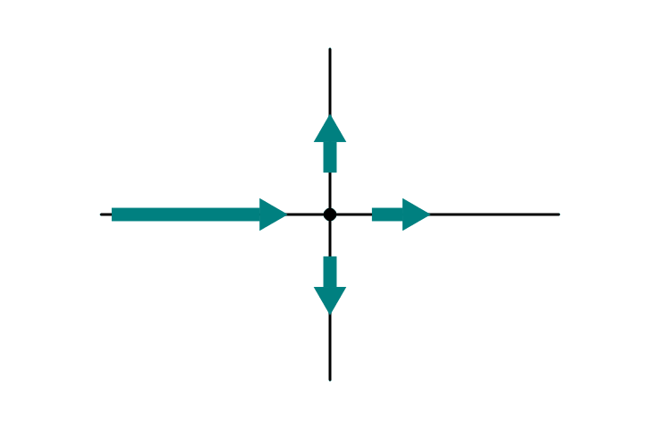
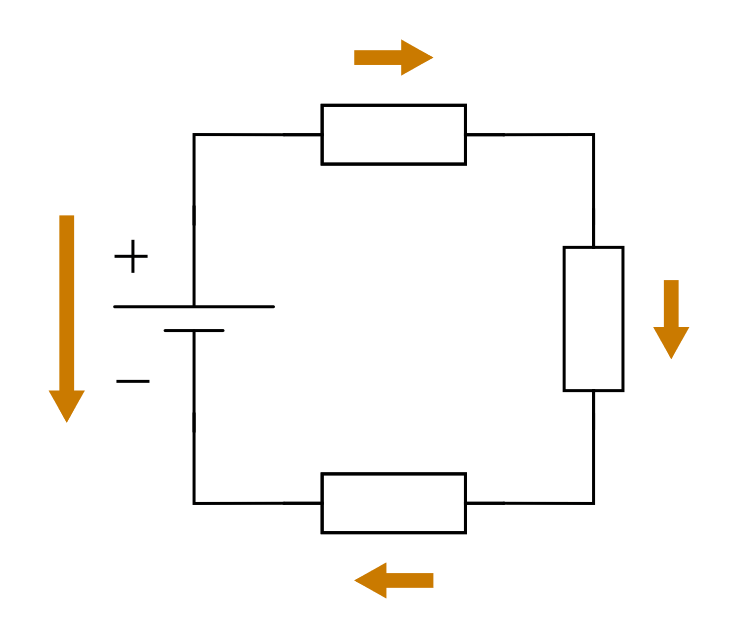

.. index:: Kirchhoffsche Regeln

Die Knotenregel und die Maschenregel
====================================

Häufig gilt es, die in einem Stromkreis fließende Gesamtspannung bzw.
-Stromstärke zu ermitteln. Hierzu gibt es zwei allgemeingültige
Gesetzmäßigkeiten, die als Maschen- und Knotenregel oder nach ihrem Entdecker
`Gustav Robert Kirchhoff
<http://de.wikipedia.org/wiki/Gustav_Robert_Kirchhoff>`_ auch als Kirchhoffsche
Regeln bekannt sind.

.. index::
    single: Kirchhoffsche Regeln; Knotenregel
.. _Die Knotenregel:

Die Knotenregel
---------------

Als Knoten wird eine leitende Verbindung zweier oder mehrerer Leiter bezeichnet.

Aufgrund der Ladungserhaltung ergibt es sich, dass an jedem Knotenpunkt die
Menge der zufließenden Ladung gleich der Menge der abfließenden Ladung sein
muss. Somit muss auch die Summe der zufließenden Stromstärken
:math:`I_{\mathrm{in, 1}},\; I_{\mathrm{in, 2}},\; \ldots` gleich der Summe der
abfließenden Stromstärken :math:`I_{\mathrm{out, 1}},\; I_{\mathrm{out, 2}},\;
\ldots` sein.

.. math::

    I_{\mathrm{in, 1}} + I_{\mathrm{in, 2}} + I_{\mathrm{in, 3}} + \ldots =
    I_{\mathrm{out, 1}} + I_{\mathrm{out, 2}} + I_{\mathrm{out, 3}} + \ldots

Zählt man die Werte der zufließenden Stromstärke(n) :math:`I_{\mathrm{in}}` als
positiv und die Werte der abfließenden Stromstärke(n) :math:`I_{\mathrm{out}}`
als negativ, so lässt sich die obige Gleichung mit dem Summenzeichen
:math:`\Sigma` einfacher schreiben als:

.. math::
    :label: eqn-knotenregel

    \sum_{}^{} I = 0

Sämtliche Ströme eines Knoten müssen in der Summe stets null ergeben.

    Die Knotenregel ("1. Kirchhoffsche Regel").

    .. only:: html

        :download:`SVG: Knotenregel
        <../pics/schaltungen/knotenregel.svg>`

.. index::
    single: Kirchhoffsche Regeln; Maschenregel
.. _Die Maschenregel:

Die Maschenregel
----------------

Als Masche wird eine geschlossene Aneinanderreihung von Bauteilen bezeichnet.

Die Spannungswerte der Stromquellen :math:`U_{\mathrm{\uparrow \, 1}},\;
U_{\mathrm{\uparrow \, 2}},\; \ldots` müssen in der Summe gleich der Summe der
einzelnen an den Verbrauchern anliegenden Spannungen
:math:`U_{\mathrm{\downarrow \, 1}},\; U_{\mathrm{\downarrow \, 2}},\; \ldots`
sein.

.. math::

    U_{\mathrm{\uparrow \, 1}} + U_{\mathrm{\uparrow \, 2}} +
    U_{\mathrm{\uparrow \, 3}} + \ldots = U_{\mathrm{\downarrow \, 1}} +
    U_{\mathrm{\downarrow \, 2}} + U_{\mathrm{\downarrow \, 3}} + \ldots

Zählt man wiederum die Spannungswerte der Stromquellen
:math:`U_{\mathrm{\uparrow }}` als positiv und die Spannungswerte der
Verbraucher :math:`I_{\mathrm{\downarrow }}` als negativ, so lässt sich die
obige Gleichung mit dem Summenzeichen :math:`\Sigma` einfacher schreiben als:

.. math::
    :label: eqn-maschenregel

    \sum_{}^{} U = 0

Sämtliche Spannungen innerhalb einer Masche müssen in der Summe stets null ergeben.

    Die Maschenregel ("2. Kirchhoffsche Regel").

    .. only:: html

        :download:`SVG: Maschenregel
        <../pics/schaltungen/maschenregel.svg>`

.. todo übungsaufgaben
