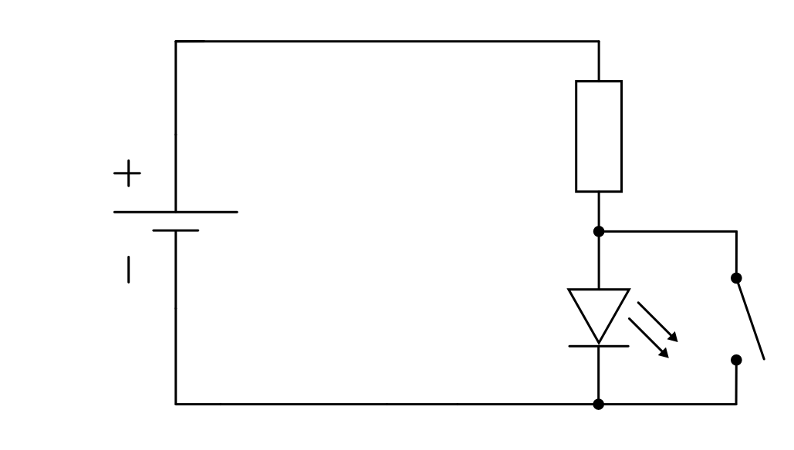
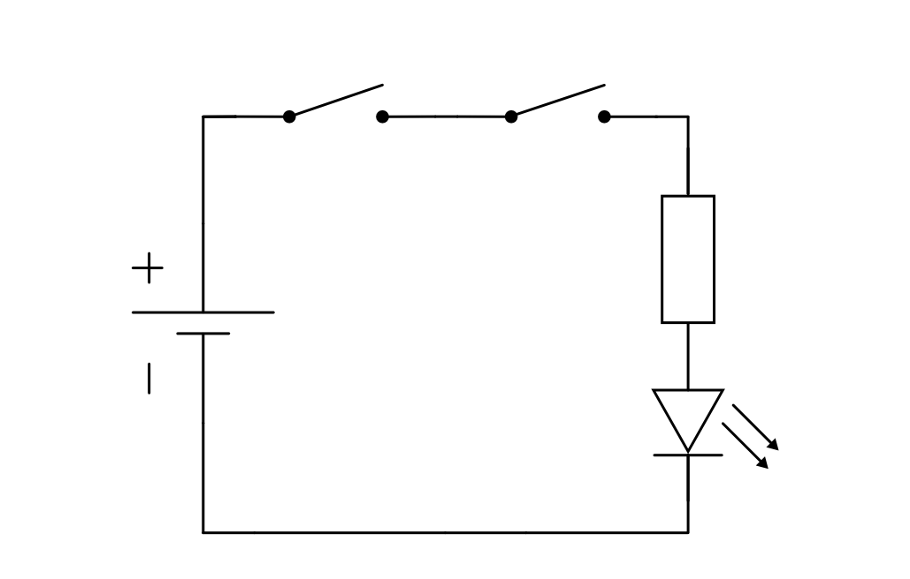
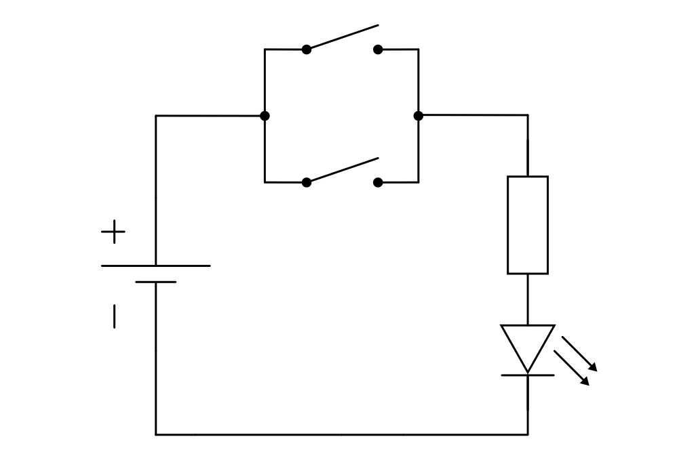
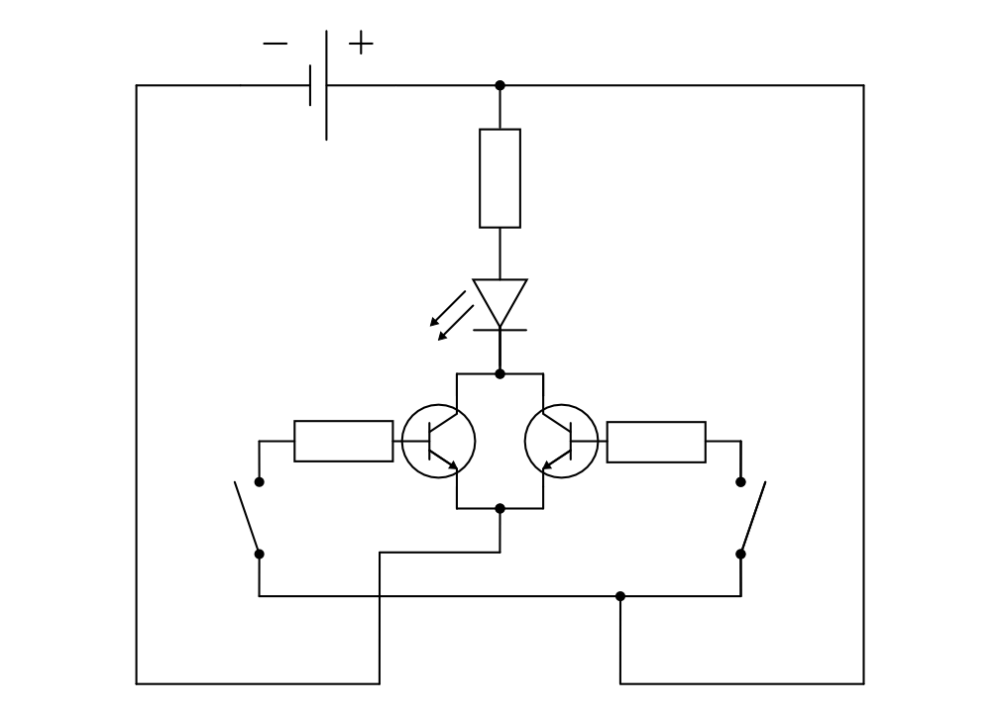

.. _Logik-Grundschaltungen:

Logik-Grundschaltungen
======================

Logik-Grundschaltungen ("Gatter") bilden die Basis für die binäre
Digitaltechnik. Sie dienen als Umsetzungen für die Rechenoperationen NICHT, UND,
ODER sowie ENTWEDER-ODER der mathematischen Logik. [#]_

Die oben genannten Verknüpfungen lassen sich auf einfache Weise durch
mechanische Schalter oder etwas komplizierter -- mit elektronischer Steuerung und
ohne mechanische Bauteile -- durch Transistoren erreichen.

.. _NICHT-Schaltung:

NICHT-Schaltungen
-----------------

Eine einfache NICHT-Schaltung lässt sich mit Hilfe eines Schalters bzw. Tasters
erreichen, der parallel zum Hauptstromkreis (im :ref:`Schema einer
NICHT-Schaltung (mechanisch) <fig-logikgatter-nicht-mechanisch>` eine LED mit
Vorwiderstand) geschaltet wird. Ist der Schalter *nicht* geschlossen, so fließt
Strom durch den Hauptstromkreis -- die LED leuchtet. Wird der Schalter
geschlossen, so wird dem Hauptstromkreis die nötige Betriebsspannung entzogen.
[#]_

    Schema einer NICHT-Schaltung mit einem mechanischen Schalter.

    .. only:: html
    
        :download:`SVG: NICHT-Schaltung (mechanisch)
        <../pics/schaltungen/logikgatter-nicht-mechanisch.svg>`

Durch eine Parallelschaltung wird somit die gewöhnliche Funktion des Schalters
umgekehrt ("invertiert"). Als Alternative kann ebenso ein Taster bzw. Schalter
(in Reihe) eingebaut werden, der im Ausgangszustand geschlossen ist und bei
Betätigung den Stromkreis unterbricht. 

.. _UND-Schaltung:

UND-Schaltungen
---------------

Eine einfache UND-Schaltung lässt sich durch den Einsatz zweier Schalter oder
Taster erreichen. Werden diese als Reihenschaltung angeordnet, so kann nur Strom
fließen, wenn *beide* Schalter gleichzeitig geschlossen sind.

    Schema einer UND-Schaltung mit zwei mechanischen Schaltern.

    .. only:: html
    
        :download:`SVG: UND-Schaltung (mechanisch)
        <../pics/schaltungen/logikgatter-und-mechanisch.svg>`

UND-Schaltungen in der obigen Form finden beispielsweise als Sicherheitsschalter
Verwendung.

.. _ODER-Schaltung:

ODER-Schaltungen
----------------

Eine einfache ODER-Schaltung lässt sich erreichen, indem zwei (oder mehrere)
Schalter bzw. Taster parallel zueinander geschaltet werden. Es kann nur dann ein
Strom im Hauptstromkreis fließen, wenn der eine oder der andere Schalter oder
beide zugleich geschlossen sind.

    Schema einer ODER-Schaltung mit zwei mechanischen Schaltern.

    .. only:: html
    
        :download:`SVG: ODER-Schaltung (mechanisch)
        <../pics/schaltungen/logikgatter-oder-mechanisch.svg>`

Eine elektronisch gesteuerte ODER-Schaltung lässt sich mittels zweier
Transistoren realisieren. Beide Transistoren verfügen dabei über einen
gemeinsamen Kollektor- und Emitteranschluss. Wird an die Basis eines oder beider
Transistoren eine positive Spannung angelegt, so wird der Hauptstromkreis
geschlossen -- die LED im :ref:`Schema einer ODER-Schaltung
<fig-logikgatter-oder>` leuchtet auf. [#]_

    Schema einer ODER-Schaltung mit zwei Transistoren

    .. only:: html
    
        :download:`SVG: ODER-Schaltung
        <../pics/schaltungen/logikgatter-oder.svg>`

.. _XODER-Schaltung:

XODER-Schaltungen
-----------------

Eine mechanische XODER-Schaltung ("exklusives" ODER) kann durch zwei
Wechselschalter mit umgekehrter Anschlussbelegung realisiert werden. Ein
Stromfluss im Hauptstromkreis ist auf diese Weise nur dann möglich, wenn
entweder der eine oder der andere Schalter geschlossen ist. Sind beide Schalter
geschlossen oder geöffnet, kann kein Strom fließen.

.. figure::
    ../pics/schaltungen/logikgatter-xoder-mechanisch.png
    :name:  fig-logikgatter-xoder-mechanisch
    :alt:   fig-logikgatter-xoder-mechanisch
    :align: center
    :width: 50%

    Schema einer XODER-Schaltung mit zwei mechanischen Wechselschaltern.

    .. only:: html
    
        :download:`SVG: XODER-Schema (mechanisch)
        <../pics/schaltungen/logikgatter-xoder-mechanisch.svg>`

.. raw:: html

    

.. only:: html

    .. rubric:: Anmerkungen:

.. [#]  Siehe :ref:`Verknüpfungen von Aussagen <Verknüpfungen von Aussagen>`.
.. [#]  Bei geschlossenem Schalter sind im :ref:`Schema einer NICHT-Schaltung
        (mechanisch) <fig-logikgatter-nicht-mechanisch>` beide Seiten der LED
        direkt mit dem Minuspol der Stromquelle verbunden. Die Abzweigung zum
        parallel eingebauten Schalter erfolgt erst nach dem Vorwiderstand der
        LED, um beim Betätigen des Schalters einen Kurzschluss zu verhindern.

.. [#]  Die beiden mechanischen Schalter im :ref:`Schema einer ODER-Schaltung
        <fig-logikgatter-oder>` dienen lediglich dazu, die beiden
        Basis-Anschlüsse der Transistoren mit der konstanten Stromquelle zu
        verbinden. In einer "echten" elektronisch geregelten ODER-Schaltung
        kommen die Spannungssignale von einem anderen integrierten Schaltkreis,
        beispielsweise von einem Timer-IC.

