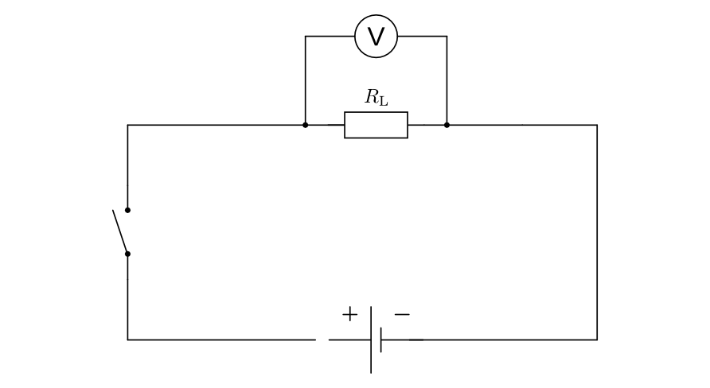
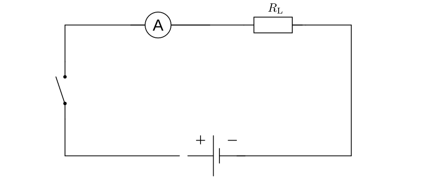
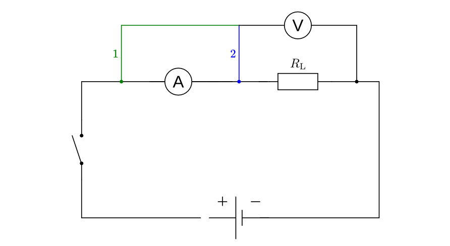
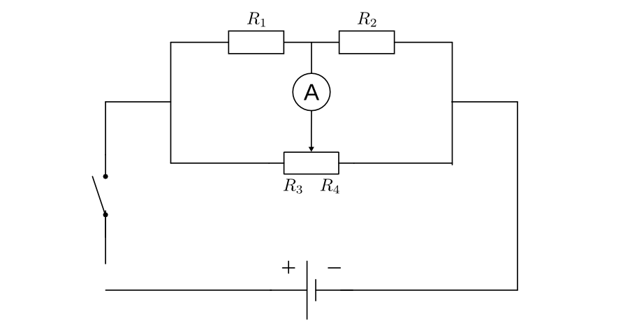

.. _Mess- und Prüfschaltungen:

Mess- und Prüfschaltungen
=========================

.. index:: Spannungsmessung
.. _Spannungsmessung:

Spannungsmessung
----------------

Zur Spannungsmessung werden Spannungs-Messgeräte ("Voltmeter") verwendet; diese
gibt es sowohl in analoger wie auch in digitaler Bauweise. Auch gewöhnliche
Multimeter können als Spannungs-Messgeräte verwendet werden, indem der
Drehschalter je nach Bedarf auf Gleichspannungs- beziehungsweise
Wechselspannung gestellt wird.

.. todo pic

Kontaktiert man in einem eingeschalteten Stromkreis mit den beiden Prüfspitzen
zwei Anschlüsse eines Bauteils, so bildet der Innenwiderstand des Voltmeters und
das Bauteil eine :ref:`Parallelschaltung zweier Widerstände <Parallelschaltung
von Widerständen>`. Die beiden am Voltmeter und am Bauteil anliegenden
Spannungen sind in diesem Fall gleich.

    Schaltung zur Messung von Spannungen mittels eines Voltmeters.

    .. only:: html

        :download:`SVG: Mess-Schaltung (Spannung)
        <../pics/schaltungen/mess-schaltung-stromstaerke.svg>`

Der durch die Messung entstehende Messfehler ist umso kleiner, je höher der
Innenwiderstand des Voltmeters ist; Voltmeter besitzen daher stets einen sehr
hohen elektrischen Widerstand.

.. _Messbereichserweiterung Spannungsmessung:

.. rubric:: Messbereichserweiterung

Bei analogen Voltmetern ist der Messbereich prinzipiell durch das Ende der Skala
begrenzt; liegt eine größere Spannung am Messgerät an, so kann einerseits der
Zeiger des Messgeräts nicht weiter ausschlagen, andererseits sogar das Messgerät
beschädigt werden. Um den Messbereich nach oben zu erweitern, muss man durch
eine geeignete Schaltung erreichen, dass nur ein Teil der zu messenden Spannung
am Voltmeter anliegt.

.. todo pic

Dies kann erreicht werden, indem man das Voltmeter mit einem in Reihe
geschalteten Vorwiderstand kombiniert. Hat ein Voltmeter mit einem Messbereich
von :math:`\unit[50]{mV}` beispielsweise einen Innenwiderstand von
:math:`\unit[100]{\Omega}`, so bewirkt ein Vorwiderstand mit einer Größe von
:math:`\unit[900]{\Omega}`, dass nur noch :math:`1/10` der Spannung am Voltmeter
abfällt. Der Messbereich wird somit um den Faktor :math:`10` erhöht, so dass
mit dem Voltmeter nun Spannungen bis zu :math:`\unit[500]{mV}` gemessen werden
können.

Der Messbereich-Erweiterung sind nach oben hin kaum Grenzen gesetzt. Hat der
Vorwiderstand im obigen Beispiel den Wert :math:`\unit[99\,900]{\Omega}`, so
beträgt der Gesamtwiderstand :math:`\unit[100\,000]{\Omega}`, und nur
:math:`1/1000` der anliegenden Spannung fällt am Voltmeter ab. Entsprechend kann
eine :math:`1000`-fach höhere Spannung, also maximal :math:`\unit[50]{V}`
gemessen werden.

Bei Digital-Messgeräten erfolgt die Messung elektronisch und wird auf einem
Display digital angezeigt. Das Problem der Messfehler sowie das Prinzip der
Messbereich-Erweiterung ist allerdings bei analogen sowie digitalen Messgeräten
identisch.

.. index:: Strommessung
.. _Strommessung:

Strommessung
------------

Zur Strommessung werden Strom-Messgeräte ("Amperemeter") verwendet; auch diese
gibt es sowohl in analoger wie auch in digitaler Bauweise. Gewöhnliche
Multimeter können ebenfalls als Strom-Messgeräte verwendet werden, indem man den
Drehschalter auf Strommessung einstellt.

.. todo pic

Zur Strommessung muss das Amperemeter in Reihe mit dem zu messenden Bauteil
geschaltet werden. [#]_ Der Innenwiderstand des Amperemeters und das Bauteil bilden
in diesem Fall eine :ref:`Reihenschaltung zweier Widerstände <Reihenschaltung
von Widerständen>`. Durch das Amperemeter und das Bauteil muss somit der gleiche
Strom hindurch fließen.

    Schaltung zur Messung von Stromstärken mittels eines Amperemeters.

    .. only:: html

        :download:`SVG: Mess-Schaltung (Stromstärke)
        <../pics/schaltungen/mess-schaltung-stromstaerke.svg>`

Der durch die Messung entstehende Messfehler ist umso kleiner, je kleiner der
Innenwiderstand des Amperemeters ist; Amperemeter besitzen daher stets einen
sehr geringen elektrischen Widerstand.

.. _Messbereichserweiterung Strommessung:

.. rubric:: Messbereichserweiterung

Bei analogen Amperemetern ist der Messbereich ebenfalls durch das Ende der Skala
begrenzt; fließt ein größerer Strom durch das Messgerät, so kann wiederum der
Zeiger des Messgeräts nicht weiter ausschlagen beziehungsweise sogar das
Messgerät beschädigt werden. Um den Messbereich nach oben zu erweitern, muss
auch in diesem Fall erreicht werden, dass nur ein Teil des zu messenden
Stroms durch das Amperemeter fließt.

.. todo pic

Dies ist möglich, wenn das Amperemeter mit einem parallel geschalteten
Widerstand kombiniert wird. Hat ein Amperemeter mit einem Messbereich von
:math:`\unit[50]{mA}` beispielsweise einen Innenwiderstand von
:math:`\unit[10]{\Omega}`, so bewirkt ein parallel geschalteter Widerstand mit
ebenfalls :math:`\unit[10]{\Omega}`, dass nur noch die Hälfte des Stroms durch
das Amperemeter fließt. Der Messbereich wird somit um den Faktor :math:`2`
erweitert, so dass mit dem Amperemeter nun Stromstärken bis zu
:math:`\unit[500]{mA}` gemessen werden können.

Der Messbereich-Erweiterung von Amperemetern sind nach oben hin ebenfalls kaum
Grenzen gesetzt. Üblicherweise sind die Parallel-Widerstände bereits im
Amperemeter eingebaut und können durch einen Drehschalter zugeschaltet werden.

.. todo Poggendorffsches Kompensationsverfahren

.. index:: Widerstandsmessung
.. _Widerstandsmessung:

Widerstandsmessung
------------------

Die Größe eines Widerstands gemäß des :ref:`Ohmschen Gesetzes <Ohmsches Gesetz>`
:math:`R = \frac{U}{I}` bestimmt werden, wenn bekannt ist, welche Spannung
:math:`U` am Widerstand anliegt und welche Stromstärke :math:`I` dabei durch den
Widerstand fließt.

    Schaltung zur Messung von Widerständen mittels eines Volt- und eines
    Amperemeters.

    .. only:: html

        :download:`SVG: Mess-Schaltung (Widerstand)
        <../pics/schaltungen/mess-schaltung-widerstand.svg>`

Die Bestimmung des Widerstands eines Bauteils nach dieser Methode setzt also
eine Strom- sowie eine Spannungsmessung voraus. Dabei gibt es, wie in der obigen
Abbildung angedeutet, prinzipiell zwei Möglichkeiten:  Bei Variante :math:`1`
zeigt das Voltmeter einen zu hohen Wert an, denn ein Teil der am Voltmeter
anliegenden Spannung fällt am Innenwiderstand des Amperemeters ab. Bei der
Variante :math:`2` zeigt das Amperemeter einen zu hohen Wert an, denn ein Teil
des durch das Amperemeter fließenden Stroms fließt anschließend durch das
Voltmeter.

Der Widerstand eines Bauteils kann auch mit nur einem einzelnen Messgerät
bestimmt werden, sofern die Spannung bekannt ist. Eine derartige Messung setzt
voraus, dass das zu messende Bauteil ausgebaut ist oder zumindest der
Stromkreis, welcher das Bauteil umgibt, nicht geschlossen ist. Das Messgerät,
meist ein Multimeter, kann dann selbst als Spannungsquelle mit bekanntem
Spannungswert dienen, sofern darin eine Batterie verbaut ist. Die
Widerstandsmessung entspricht damit einer Messung der Stromstärke, jedoch mit
einer entsprechend angepassten Skala.

.. index:: Wheatstonesche Messbrücke
.. _Wheatstonesche Messbrücke:
.. _Die Wheatstonesche Messbrücke:

.. rubric:: Die Wheatstonesche Messbrücke

Eine weitere Möglichkeit der Widerstandsmessung besteht in der Verwendung einer
nach `Charles Wheatstone <https://de.wikipedia.org/wiki/Wheatstone>`__ benannten
"Wheatstoneschen Messbrücke". Eine solche ist folgendermaßen aufgebaut:

    Schaltung einer Wheatstoneschen Brücke zur Widerstandsmessung mittels eines
    Amperemeters.

    .. only:: html

        :download:`SVG: Wheatstonesche Messbrücke
        <../pics/schaltungen/wheatstonesche-brueckenschaltung.svg>`

- Der zu messende Widerstand :math:`R_1` ist mit einem bekannten Widerstand
  :math:`R_2` in Reihe geschaltet.
- Parallel dazu wird ein regelbarer Widerstand (Potentiometer) mit
  verschiebbarem Stromabnehmer angebracht; Durch diesen wird der
  Gesamtwiderstand des Potentiometers in zwei (zueinander in Reihe liegenden)
  Teilwiderstände :math:`R_3` und :math:`R_4` aufgeteilt, wobei über die
  Position des Stromabnehmers das Verhältnis dieser beiden Widerstände
  eingestellt werden kann.
- Zwischen dem Stromabnehmer und den zwei Widerständen :math:`R_1` und
  :math:`R_2` wird ein empfindliches Amperemeter eingebaut.

Zur Messung des Widerstands nach dieser Methode wird der Stromabnehmer so lange
hin- und hergeschoben, bis das Amperemeter keine Stromfluss mehr anzeigt. In
dieser Position wird die an der Wheatstoneschen Messbrücke anliegende Spannung
innerhalb der beiden Stromzweigen (:math:`R_1` und :math:`R_2` beziehungsweise
:math:`R_3` und :math:`R_4)` im gleichen Verhältnis geteilt. In diesem Fall gilt
also:

.. math::

    \frac{R_1}{R_2} = \frac{R_3}{R_4}

Da :math:`R_2` bekannt ist und das Verhältnis von :math:`R_3` zu :math:`R_4` mit
Hilfe einer am Potentiometer anliegenden Skala abgelesen werden kann, lässt sich
der gesuchte Widerstand :math:`R_1` unmittelbar mit Hilfe des obigen
Widerstandsverhältnisses bestimmen:

.. math::

    R_1 =\frac{R_3}{R_4} \cdot R_2

Da das Potentiometer letztlich aus einem zu einer langen Spule aufgewickelten
Widerstandsdraht besteht und der Widerstand eines homogenen Leiters direkt
proportional zu dessen Länge ist, ist das Zahlenverhältnis der Widerstände
:math:`R_3 : R_4` identisch mit dem Verhältnis :math:`l_3 : l_4` der beiden
Spulenlängen links und rechts vom Stromabnehmer. Als Skala am Potentiometer
genügt folglich eine einfache Millimeter-Skala.

.. raw:: html

    

.. only:: html

    .. rubric:: Anmerkungen:

.. [#] Die Reihenschaltung eines Amperemeters mit einem bereits in einem
    Stromkreis verbauten Bauteil ist nicht immer einfach; beispielsweise kann
    bei fertig gelöteten Platinen kein weiteres Bauteil eingefügt werden. Es ist
    jedoch möglich, zunächst die am Bauteil anliegende Spannung zu messen, den
    Stromkreis zu unterbrechen, und mittels eines externen regelbaren
    Netzgerätes einen Stromkreis aus Netzgerät, Bauteil und Amperemeter
    herzustellen.
