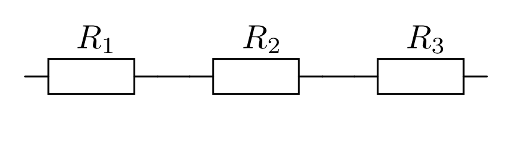
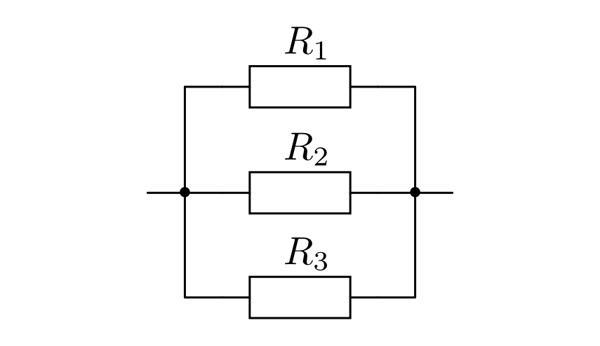
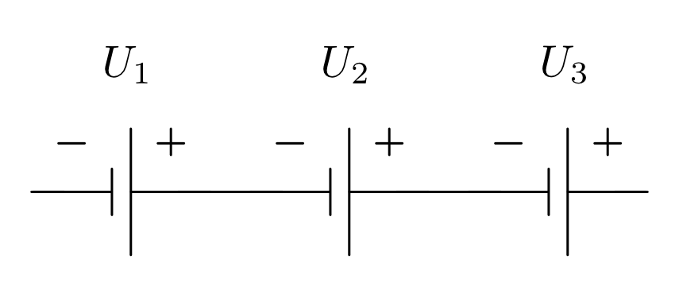
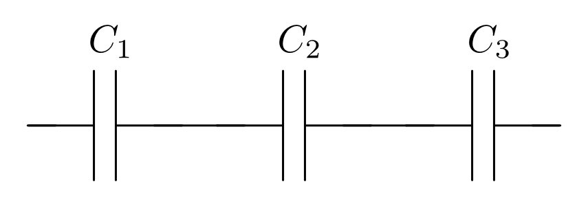

.. index::
    single: Reihenschaltung
    single: Parallelschaltung
.. _Reihen- und Parallelschaltungen:

Reihen- und Parallelschaltungen
===============================

Im folgenden wird behandelt, welche Auswirkungen sich durch eine Reihen- oder
Parallelschaltung mehrerer Widerstände, Stromquellen oder Kondensatoren
ergeben.

.. _Reihen- und Parallelschaltung von Widerständen:

Reihen- und Parallelschaltung von Widerständen
----------------------------------------------

In (fast) jedem Stromkreis befinden sich mehrere Verbraucher, d.h. elektrische
Widerstände. Wie diese in ihrer Gesamtheit wirken, hängt davon ab, ob sie
parallel oder in Reihe geschaltet sind.

..  (Verbrauchern)

.. index::
    Reihenschaltung; von Widerständen
.. _Reihenschaltung von Widerständen:

.. rubric:: Reihenschaltung von Widerständen

Bei einer Reihenschaltung von :math:`n` Widerständen ist der Gesamtwiderstand
:math:`R _{\rm{ges}}` gleich der Summe der Einzelwiderstände :math:`R
_{\rm{1}},\; R _{\rm{2}},\; \ldots,\; R _{\rm{n}}`:

.. math::
    :label: eqn-reihenschaltung-widerstand

    R _{\rm{ges}} &= R _{\rm{1}} + R _{\rm{2}} + \ldots + R _{\rm{n}} \\
    &= \sum_{i=1}^{n} R  _{\rm{i}}

Werden beispielsweise drei Widerstände der Größe :math:`R = \unit[100]{\Omega }`
in Reihe geschaltet, so wirken sie zusammen wie ein Widerstand der Größe
:math:`R _{\rm{ges}} = \unit[100]{\Omega } + \unit[100]{\Omega } +
\unit[100]{\Omega } = \unit[300]{\Omega }`.

    Reihenschaltung von drei Widerständen.

    .. only:: html

        :download:`SVG: Reihenschaltung von Widerständen
        <../pics/schaltungen/reihenschaltung-von-widerstaenden.svg>`

Die an einer Reihenschaltung anliegende Gesamtspannung :math:`U _{\rm{ges}}`
teilt sich gemäß der :ref:`Maschenregel <Die Maschenregel>` in :math:`n`
Teilspannungen :math:`U _{\rm{1}},\; U _{\rm{2}},\; \ldots` auf. Dabei ist die
Gesamtspannung gleich der Summe der einzelnen Teilspannungen:

.. math::
    :label: eqn-reihenschaltung-spannung

    U _{\rm{ges}} &= U _{\rm{1}} + U _{\rm{2}} + \ldots + U _{\rm{n}} \\
    &= \sum_{i=1}^{n} U  _{\rm{i}}

Die Stromstärke :math:`I _{\rm{ges}}`, die mehrere in Reihe geschaltete
Widerstände durchfließt, ist an allen Stellen der Reihenschaltung gleich. Somit
gilt:

.. math::
    :label: eqn-reihenschaltung-stromstärke

    I _{\rm{ges}} = I _{\rm{1}} = I _{\rm{2}} = \ldots = I _{\rm{n}}

Diese Tatsache wird u.a. zur Stromstärkemessung genutzt, indem ein Amperemeter
an einer beliebigen Stelle in den zu untersuchenden (Teil-)Stromkreis als
Reihenschaltung eingefügt wird.

Ist der Widerstandswert :math:`R` eines Widerstands einer Reihenschaltung
bekannt, kann mit Hilfe der obigen Formeln und des :ref:`Ohmschen Gesetzes
<Ohmsches Gesetz>` auf die am Widerstand anliegende Spannung :math:`U` bzw. auf
die durch den Widerstand fließende Stromstärke :math:`I` geschlossen werden:

.. math::

    U = R \cdot I _{\rm{ges}} \quad ; \quad I = I _{\rm{ges}} = \frac{U
    _{\rm{ges}}}{R _{\rm{ges}}}

.. index::
    Parallelschaltung; von Widerständen
.. _Parallelschaltung von Widerständen:

.. rubric:: Parallelschaltung von Widerständen

Bei einer Parallelschaltung von :math:`n` Widerständen addieren sich die Kehrwerte
der Einzelwiderstände :math:`R _{\rm{1}},\; R _{\rm{2}},\; \ldots` zum Kehrwert
des Gesamtwiderstandes :math:`R _{\rm{ges}}` auf:

.. math::
    :label: eqn-parallelschaltung-widerstand

    \frac{1}{R _{\rm{ges}}} &= \frac{1}{R _{\rm{1}} } + \frac{1}{R _{\rm{2}} } +
    \ldots + \frac{1}{R _{\rm{n}}} \\
    &= \sum_{i=1}^{n} \frac{1}{R  _{\rm{i}}}

Werden beispielsweise drei Widerstände der Größe :math:`R = \unit[100]{\Omega }`
parallel zueinander geschaltet, so ergibt sich für den Kehrwert des
Gesamtwiderstands :math:`\frac{1}{R _{\rm{ges}}} = \unit[\frac{1}{100}]{\Omega }
+ \unit[\frac{1}{100} ]{\Omega } + \unit[\frac{1}{100} ]{\Omega } =
\unit[\frac{3}{100} ]{\Omega }`. Der Gesamtwiderstand beträgt somit :math:`R
_{\rm{ges}} = \unit[\frac{100}{3} ]{\Omega } \approx \unit[33,3]{\Omega }`.

    Parallel von drei Widerständen.

    .. only:: html

        :download:`SVG: Parallelschaltung von Widerständen
        <../pics/schaltungen/parallelschaltung-von-widerstaenden.svg>`

An allen :math:`n` Widerständen einer Parallelschaltung liegt die gleiche
Spannung an. Diese ist gleich der Gesamtspannung :math:`U _{\rm{ges}}`:

.. math::
    :label: eqn-parallelschaltung-spannung

    U _{\rm{ges}} = U _{\rm{1}} = U _{\rm{2}} = \ldots = U _{\rm{n}}

Diese Tatsache wird u.a. zur Spannungsmessung genutzt, indem ein Voltmeter
parallel zum untersuchten (Teil-)Stromkreis bzw. Bauteil geschalten wird.

Die Stromstärke :math:`I _{\rm{ges}}` teilt sich bei einer Parallelschaltung
gemäß der :ref:`Knotenregel <Die Knotenregel>` auf :math:`n` Teilstromstärken
auf:

.. math::
    :label: eqn-parallelschaltung-stromstärke

    I _{\rm{ges}} &= I _{\rm{1}} + I _{\rm{2}} + \ldots + I _{\rm{n}} \\
    &= \sum_{i=1}^{n} I  _{\rm{i}}

Ist der Widerstandswert :math:`R` eines Widerstands einer Parallelschaltung
bekannt, kann wiederum mit Hilfe der obigen Formeln und des :ref:`Ohmschen
Gesetzes <Ohmsches Gesetz>` auf die am Widerstand anliegende Spannung
:math:`U` bzw. auf die durch den Widerstand fließende Stromstärke :math:`I`
geschlossen werden:

.. math::

    U = U _{\rm{ges}} \quad ; \quad I = \frac{U _{\rm{ges}}}{R}

.. _Reihen- und Parallelschaltung von Stromquellen:

Reihen- und Parallelschaltung von Stromquellen
----------------------------------------------

Um in einem Stromkreis eine höhere Spannung oder eine größere nutzbare
Stromstärke herbeizuführen, können auch mehrere Stromquellen (z.B. Batterien,
Akkumulatoren oder Solarzellen) in Reihe oder parallel zueinander geschalten
werden.

.. index::
    Reihenschaltung; von Stromquellen
.. _Reihenschaltung von Stromquellen:

.. rubric:: Reihenschaltung von Stromquellen

Werden :math:`n` Stromquellen in Reihe geschaltet, so addieren sich ihre
einzelnen Spannungswerte :math:`U _{\rm{1}},\; U _{\rm{2}},\; U _{\rm{n}}` zu
einer Gesamtspannung :math:`U _{\rm{ges}}`:

.. math::

    U _{\rm{ges}} &= U _{\rm{1}} + U _{\rm{2}} + \ldots + U _{\rm{n}} \\
    &= \sum_{i=1}^{n} U  _{\rm{i}}

Diese Gleichung ist formal mit Gleichung :eq:`eqn-reihenschaltung-spannung` identisch.
Der Unterschied liegt in der entgegengesetzten Wirkungsweise von Stromquellen
und Widerständen:

* In einer Reihenschaltung wird durch das Hinzufügen eines zusätzlichen
  Widerstands :math:`R _{\rm{\downarrow }}` die für die übrigen Verbraucher
  verfügbare Spannung auf :math:`U _{\rm{neu}} = U _{\rm{ges}} - R
  _{\rm{\downarrow }} \cdot I _{\rm{ges}}` reduziert.
* In einer Reihenschaltung wird durch das Hinzufügen einer zusätzlichen
  Stromquelle :math:`U _{\rm{\uparrow }}` die für die übrigen Verbraucher
  verfügbare Spannung auf :math:`U _{\rm{neu}} = U _{\rm{ges}} + U
  _{\rm{\uparrow }}` erhöht.

    Reihenschaltung von drei Stromquellen.

    .. only:: html

        :download:`SVG: Reihenschaltung von Stromquellen
        <../pics/schaltungen/reihenschaltung-von-stromquellen.svg>`

Schaltet man :math:`n` gleichartige Stromquellen in Reihe, so weist die
resultierende Stromquelle eine :math:`n`-fache Spannung auf.

.. index::
    Parallelschaltung; von Stromquellen
.. _Parallelschaltung von Stromquellen:

.. rubric:: Parallelschaltung von Stromquellen

Werden :math:`n` Stromquellen parallel zueinander geschaltet, so reduzieren sich
die Teilstromstärken :math:`I _{\rm{1}},\; I _{\rm{2}},\; \ldots`, die jede
einzelne Stromquelle zur gesamten Stromstärke :math:`I _{\rm{ges}}` beisteuert.

.. math::

    I _{\rm{ges}} &= I _{\rm{1}} + I _{\rm{2}} + \ldots + I _{\rm{n}} \\
    &= \sum_{i=1}^{n} I  _{\rm{i}}

Diese Gleichung ist formal mit Gleichung :eq:`eqn-parallelschaltung-stromstärke`
identisch. An dieser Stelle hat sie zweierlei gleichsam gültige Wirkungen zur
Folge:

* Wird eine Stromquelle, die eine maximale Stromstärke :math:`I _{\rm{\uparrow }}`
  liefern kann, parallel zu einer bestehenden Stromquelle geschaltet, so erhöht
  sich die insgesamt mögliche Stromstärke auf :math:`I _{\rm{max,neu}} = I
  _{\rm{max,alt}} + I _{\rm{\uparrow }}`. [#]_

  .. pic

* Wird eine weitere Stromquelle :math:`I _{\rm{\uparrow }}` parallel zu einem
  bestehenden Stromkreis geschaltet, so wird die bisherige Stromquelle auf
  :math:`I _{\rm{neu}} = I _{\rm{ges}} - I _{\rm{\uparrow }}` "entlastet". Bei
  Stromquellen mit einem begrenzten Energiespeicher, beispielsweise Batterien
  und Akkumulatoren, wird dadurch die Entladezeit ("Lebensdauer") entsprechend
  erhöht. [#]_

    Parallelschaltung von drei Stromquellen.

    .. only:: html

        :download:`SVG: Parallelschaltung von Stromquellen
        <../pics/schaltungen/parallelschaltung-von-stromquellen.svg>`

Bei einer Parallelschaltung von :math:`n` gleichartigen Stromquellen wird die
maximal mögliche Stromstärke um das :math:`n`-fache erhöht bzw. die einzelnen
von den Stromquellen bereitgestellten (Teil-)Stromstärken um das
:math:`\frac{1}{n}`-fache reduziert.

.. _Reihen- und Parallelschaltung von Kondensatoren:

Reihen- und Parallelschaltung von Kondensatoren
-----------------------------------------------

Kondensatoren gehören ebenfalls zu den häufig verwendeten elektronischen
Bauteilen. Durch eine Reihen- oder Parallelschaltung mehrerer Kondensatoren
lässt sich ihre charakteristische Größe, die Kapazität :math:`C`,
beeinflussen.

.. index::
    Reihenschaltung; von Kondensatoren
.. _Reihenschaltung von Kondensatoren:

.. rubric:: Reihenschaltung von Kondensatoren

Werden :math:`n` Kondensatoren in Reihe geschaltet, so werden bei Anlegen der
Spannung :math:`U`  alle mit der gleichen Stromstärke :math:`I` auf eine
Ladungsmenge :math:`Q`  aufgeladen.

    Reihenschaltung von drei Kondensatoren.

    .. only:: html

        :download:`SVG: Reihenschaltung von kondensatoren
        <../pics/schaltungen/reihenschaltung-von-kondensatoren.svg>`

Wie bei Reihenschaltungen üblich, addieren sich dabei die an den einzelnen
Kondensatoren abfallenden Teilspannungen :math:`U _{\rm{i}}`, die sich mit Hilfe
der allgemeinen Kondensator-Formel :math:`(Q = C \cdot U)` als :math:`U
_{\rm{i}} =Q / C _{\rm{i}}` ausdrücken lassen:

.. math::

    U _{\rm{ges}} = \frac{Q}{C _{\rm{1}}} + \frac{Q}{ C _{\rm{2}}} + \ldots =
    \sum_{i=1}^{n} \frac{Q}{C _{\rm{i}}}

Um herauszufinden, wie mehrere Kondensatoren in ihrer Gesamtheit wirken, d.h.
welche Gesamt-Kapazität :math:`C _{\rm{ges}}` sich aus der Reihenschaltung der
:math:`n` einzelnen Kondensatoren :math:`C _{\rm{i}}` ergibt, muss man beide
Seiten der obigen Gleichung durch die konstante Ladung :math:`Q` teilen. Die
linke Seite der Gleichung entspricht dann der Gesamtkapazität :math:`C
_{\rm{ges}} = U _{\rm{ges}} / Q`, die rechte Seite der Summe aller Kehrwerte der
einzelnen Kondensatoren:

.. math::
    :label: eqn-reihenschaltung-kondensator

    C _{\rm{Ges}} = \sum_{i=1}^{n} \frac{1}{C _{\rm{i}}}

Wird zu einem bestehenden Kondensator ein weiterer in Reihe geschaltet, so nimmt
die Gesamtkapazität ab. Kondensatoren verhalten sich in einer Reihenschaltung
somit ähnlich wie Widerstände in einer Parallelschaltung.

.. index::
    Parallelschaltung; von Kondensatoren
.. _Parallelschaltung von Kondensatoren:

.. rubric:: Parallelschaltung von Kondensatoren

Werden :math:`n`  Kondensatoren parallel zueinander geschaltet, so liegt an
allen die gleiche Spannung :math:`U` an. Der Gesamtstrom :math:`I _{\rm{ges}}`
teilt sich in :math:`n` Teilströme auf, wodurch die einzelnen Kondensatoren mit
unterschiedlichen Ladungen :math:`Q _{\rm{i}}` geladen werden.

    Parallelschaltung von drei Kondensatoren.

    .. only:: html

        :download:`SVG: Parallelschaltung von kondensatoren
        <../pics/schaltungen/parallelschaltung-von-kondensatoren.svg>`

Mit Hilfe der allgemeinen Kondensator-Formel :math:`(Q = C \cdot U)` lässt sich
die Gesamt-Kapazität :math:`C _{\rm{ges}}` direkt ausdrücken:

.. math::

    C _{\rm{ges}} = \frac{Q _{\rm{ges}}}{U} = \frac{Q _{\rm{1}}}{U} + \ldots +
    \frac{Q _{\rm{n}}}{U}  = \sum_{i=1}^{n}  \frac{Q _{\rm{i}}}{U}

Die einzelnen Quotienten :math:`Q _{\rm{i}} / U` entsprechen dabei den einzelnen
Kapazitäten :math:`C _{\rm{i}}` der parallel zueinander geschalteten
Kondensatoren. Somit gilt:

.. math::
    :label: eqn-parallelschaltung-kondensator

    C _{\rm{Ges}} = \sum_{i=1}^{n} C  _{\rm{i}}

Eine Parallelschaltung zweier oder mehrerer Kondensatoren gleicht somit einem
einzigen Kondensator mit einer entsprechend größeren Kapazität. Kondensatoren
verhalten sich in einer Parallelschaltung somit ähnlich wie Widerstände in einer
Reihenschaltung.

.. raw:: html

    

.. only:: html

    .. rubric:: Anmerkungen:

.. [#]  Dies ist in der Praxis von Nutzen, wenn weitere (Verbraucher-)Widerstände
        parallel zu einem bestehenden Stromkreis geschaltet werden: Die Spannung
        :math:`U` bleibt dabei unverändert, der Gesamt-Widerstand nimmt ab und
        die nötige Stromstärke steigt. Um eine Batterie bzw. einen Akkumulator
        nicht zu überlasten, wird auch die bestehende Stromquelle um eine oder
        mehrere (meist gleichartig gebaute) parallel geschaltene Stromquellen
        erweitert.

.. [#]  Die gespeicherte Energiemenge einer Batterie oder eines Akkumulators ist
        gleich :math:`E = U \cdot I \cdot t`, wobei :math:`t` die Entladungszeit
        angibt. Bei einer Parallelschaltung bleibt die Spannung :math:`U`
        unverändert. Die gleiche Energiemenge :math:`E` entlädt sich somit
        aufgrund der niedrigeren Stromstärke :math:`I` über einen entsprechend
        längeren Zeitraum :math:`t`.

.. raw:: html

    

.. hint::

    Zu diesem Abschnitt gibt es :ref:`Versuche <Versuche zu Reihen- und
    Parallelschaltungen>` und :ref:`Übungsaufgaben <Aufgaben zu Reihen- und
    Parallelschaltungen>`.

..
    In einem unverzweigten Stromkreis ist die Stromstaerke überall gleich
    groß, die Summe der verbrauchten Spannung(en) ist gleich der
    Versorgungsspannung.

..
    In einem Stromverzweigungspunkt (Knoten) ist die Summe der zufliessenden
    Stroeme gleich der Summe der abfliessenden Stroeme.

